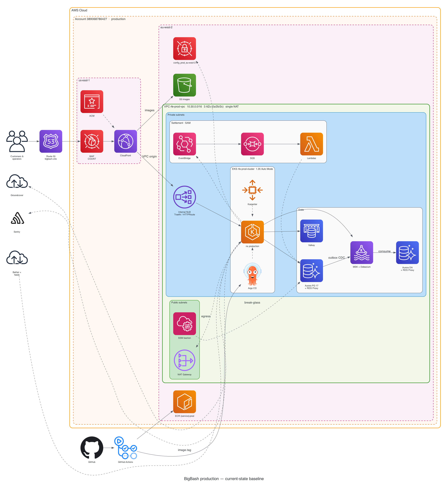
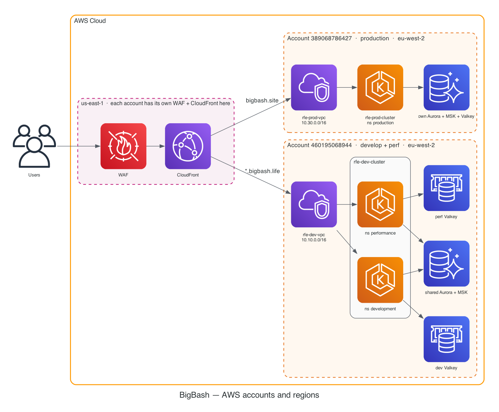
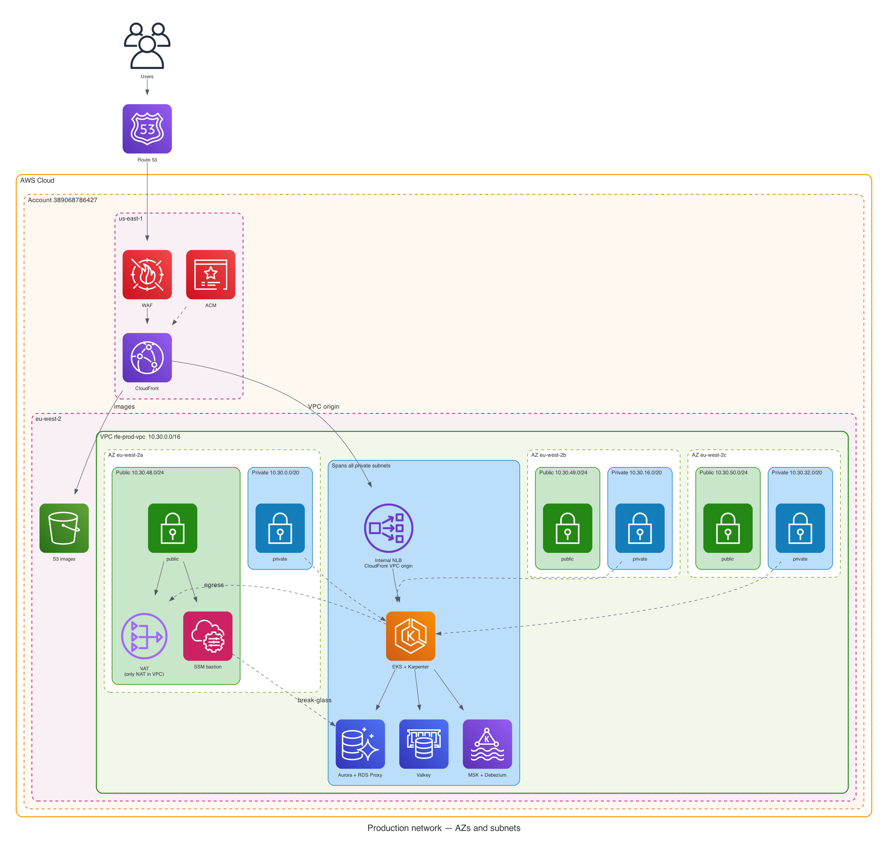

# Architecture baseline

This page is what we **design against**. The handbook is supporting detail.

| | |
|---|---|
| **Status** | Current state (not a target / future design) |
| **As of** | 2026-09-17 |
| **Owner** | `infra-team` — must match `rfetech-infra` / `rfetech-gitops` |
| **Source** | `architecture/prod_level1.py` (Python [diagrams](https://diagrams.mingrammer.com/), AWS Architecture Icons) |
| **Config truth** | `rfetech-infra/rfe-infra/rfe-prod` · VPC recipe `tf-modules/modules/VPC` |

If this picture and Terraform disagree, **Terraform wins** — then change the Python and re-render in the same PR.

Every ADR that changes topology includes a **before / after** of the affected part of this diagram ([template](/adr/template)).

---

## Level 1 — production (start here)

Read this in under a minute. Left → right is a user request. Bottom is how code reaches the cluster.



**Notice:**

1. Users hit **CloudFront**, not a pod. WAF and CloudFront certificates are in **us-east-1**; the VPC is **eu-west-2**.
2. CloudFront has two origins: **S3** (images) and an **internal NLB** (Traefik / Gateway API) — VPC origin, not on the public internet.
3. Workloads run in **EKS Auto Mode** namespace `production`. **Karpenter** supplies nodes. **Argo CD** is in-cluster.
4. Data is private: Aurora (+ RDS Proxy) and **Aurora DA**, Valkey, MSK + Debezium outbox CDC.
5. Settlement Lambdas are **SAM**, not GitOps (EventBridge → SQS → Lambda).
6. Green box = public subnets (single NAT + SSM bastion). Blue box = private subnets. Graphviz may place the public box below the private one — colour is the grouping, not vertical order.

### Legend

| Box / colour | Meaning |
|---|---|
| Orange solid | AWS Cloud |
| Orange dashed | AWS account |
| Magenta dashed | Region |
| Green solid | VPC |
| Green fill | Public subnet |
| Blue fill | Private subnet |
| Solid arrow | Runtime request or data path |
| Dashed arrow | Deploy, break-glass, egress, telemetry, vendors |

Icons are from the [AWS Architecture Icons](https://aws.amazon.com/architecture/icons/) set (via the Python `diagrams` library). Groundcover has no AWS icon — the generic cloud means the vendor.

Layout follows [AWS reference architecture diagrams](https://aws.amazon.com/architecture/reference-architecture-diagrams/): Cloud → Account → Region → VPC → subnet.

---

## Accounts at a glance

Prod is not the only account. Develop and perf **share** `460195068944` and `rfe-dev-cluster`. Perf is a namespace, not a third account.



The us-east-1 box is the **pattern** (each account has its own WAF + CloudFront there), not one shared ACL.

| | Develop | Perf | Prod |
|---|---|---|---|
| Account | `460195068944` | same | `389068786427` |
| VPC | `rfe-dev-vpc` `10.10.0.0/16` | same | `rfe-prod-vpc` `10.30.0.0/16` |
| Cluster / ns | `rfe-dev-cluster` / `development` | same cluster / `performance` | `rfe-prod-cluster` / `production` |
| Aurora + MSK | shared with perf | shares develop | own |
| Valkey / Debezium / CloudFront / ECR | own | own | own |

---

## Level 2 — drill-downs

### Network (AZs and CIDRs)

VPC module: first **3 AZs**, `single_nat_gateway = true`. CIDRs are `cidrsubnet` of `10.30.0.0/16`.



| AZ | Public | Private |
|---|---|---|
| eu-west-2a | `10.30.48.0/24` (NAT + bastion) | `10.30.0.0/20` |
| eu-west-2b | `10.30.49.0/24` | `10.30.16.0/20` |
| eu-west-2c | `10.30.50.0/24` | `10.30.32.0/20` |

C4: [Infra — Request path](/c4/). Written: [Networking](/infra/networking).

### EKS

C4: [Infra — Kubernetes compute](/c4/) · [Infra — Production](/c4/). Written: [Kubernetes](/infra/kubernetes).

### Data / eventing

C4: [Infra — Data plane](/c4/). Written: [Data stores](/infra/data-stores) · [Dependencies](/infra/dependencies).

### CI/CD

C4: [Infra — Ship path](/c4/). Written: [Compute & deploy](/infra/compute-and-deploy) · [Where to change](/infra/changes).

Interactive model: [C4 workspace](/c4-workspace/).

---

## Changing the baseline

```bash
python3 -m venv architecture/.venv
architecture/.venv/bin/pip install -r architecture/requirements.txt
# Graphviz required: brew install graphviz
PATH="/opt/homebrew/bin:$PATH" architecture/.venv/bin/python architecture/render.py
```

Commit the `.py` **and** the regenerated PNG/SVG. CI re-renders and fails if the images are stale.

Do not invent resources. If it is not in `rfetech-infra` / `rfetech-gitops`, it does not go on this diagram.
