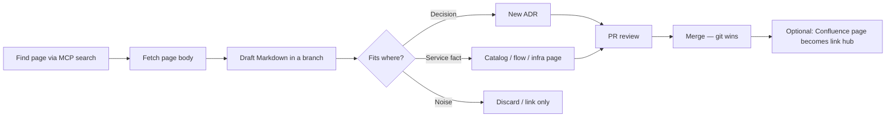

# Import workflow (Confluence → git)

Goal: harvest useful Confluence content into this SSOT without leaving two competing truths.

## Agent prompts (examples)

After MCP is connected:

- “Search Confluence for FalconX architecture and list page titles + IDs”
- “Fetch Confluence page `<id>` and draft an ADR stub under `docs/adr/`”
- “Extract the service list from page `<id>` and diff against `docs/catalog/services.md`”

## Rules

- Never commit API tokens.
- Prefer summarizing over pasting entire Confluence HTML.
- If Confluence and git disagree after import, **fix git** or open an ADR — don't silently keep both.
