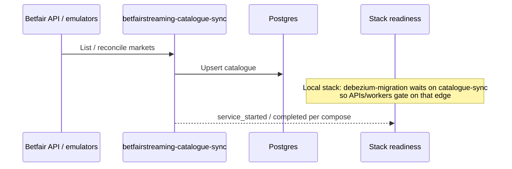

# Catalogue sync

## Intent

Ensure market catalogue in FalconX matches Betfair (or emulator) so APIs and betting see real markets.

## Happy path (logical)

## Design notes (keep current)

- Emulator mode: `BETFAIR_URL=http://emulators:8080`, catalogue-sync often runs with `--loop`.
- Distroless Go images: healthchecks must use the binary's own `healthcheck` subcommand — no `CMD-SHELL` / `curl`.

## When you change this flow

Update infra local-stack notes and any compose dependency edges; ADR if catalogue ownership moves off BetfairStreaming.
