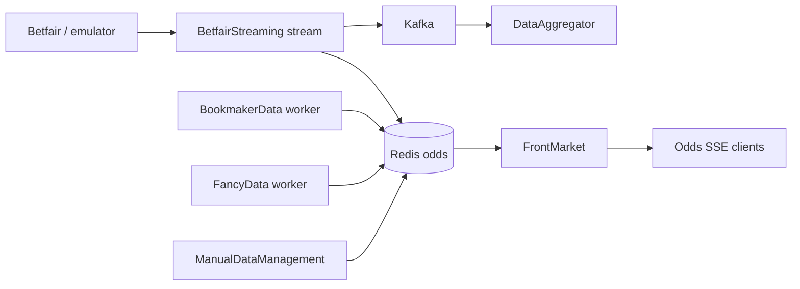

# Odds ingest

## Intent

Live prices from Betfair (or emulator) and third-party bookmaker/fancy feeds reach FrontMarket (and SSE clients) with clear publisher ownership.

## Happy path (logical)

## Design notes (keep current)

- **BetfairStreaming** (`stream | catalogue-sync | dlq-worker`) is the live Go ingestion path — not legacy `BetfairData`.
- Odds-change notices (`ODDS_CHANGE_NOTICES_ENABLED`) are on **publishers** (stream, fancy/bookmaker workers, MDM) — not on every API.
- FrontMarket SSE hub gated by `SSE_ODDS_ENABLED`.
- VPN stacks attach bookmaker/fancy/betfairstreaming to **Gluetun** (`network_mode: service:gluetun`).

## When you change this flow

Update C4 odds view + this page; ADR if Redis key contracts or publisher set changes.
