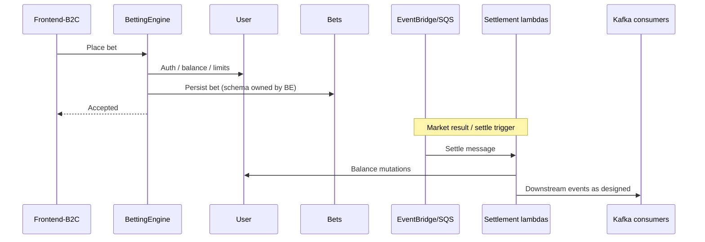

# Place bet → settle

## Intent

Customer places a bet; system validates stakes/markets; eventual settlement updates balances via the settlement pipeline.

## Happy path (logical)

## Design notes (keep current)

- **In-play vs off-play** stake routing is market-state driven; match-interruption restriction flags were removed (do not reintroduce without ADR).
- Settlement lambdas read **secrets at runtime** — never reintroduce CloudFormation Secrets Manager dynamic refs (`resolve:secretsmanager`) that bake values at deploy time.
- Local/isolated lambdas deploy via **samconfig namespaces** only (`SAM_CONFIG_ENV`), not ad-hoc CLI parameter overrides.

## When you change this flow

Update this page + open an ADR if the bus, lambda set, or balance ownership changes.
