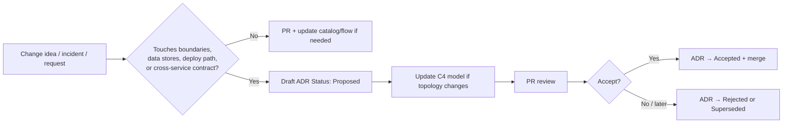

# How we decide

This site exists so engineers can change FalconX after launch **without tribal knowledge**.

## Decision loop

## What requires an ADR

Write an ADR when the change:

- Adds/removes a **service boundary** or splits/merges ownership of data
- Changes a **cross-service contract** (API, Kafka topic semantics, Redis key shape used by multiple services)
- Changes **deploy path** (new lambda, new env, new dependency on VPN/emulator, etc.)
- Chooses among **durable alternatives** the team might reverse later
- Declares something **legacy / out of rollout** (e.g. BetfairData, OrderStreaming)

Skip an ADR for pure refactors, bugfixes, and docs-only typo fixes — still update catalog/flows if behavior readers rely on changes.

## Roles

| Role | Responsibility |
|---|---|
| Author | Drafts ADR + C4/catalog deltas in one PR |
| Reviewers | Domain owners of affected services |
| Merger | Ensures Status, Consequences, and links are complete |

## Related

- [ADR template](/adr/template)
- [Updating the SSOT](/guide/updating-ssot)
- [How to use](/guide/how-to-use)
