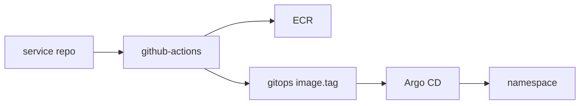
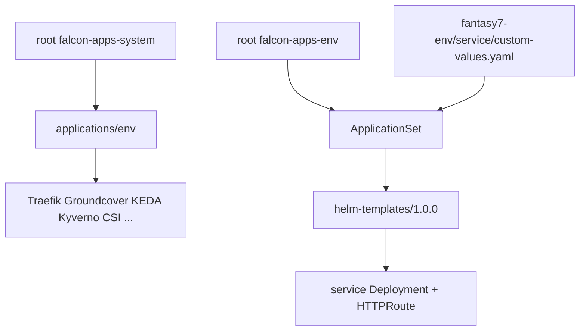
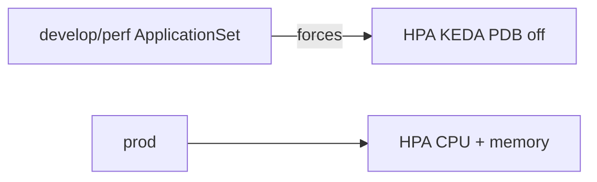
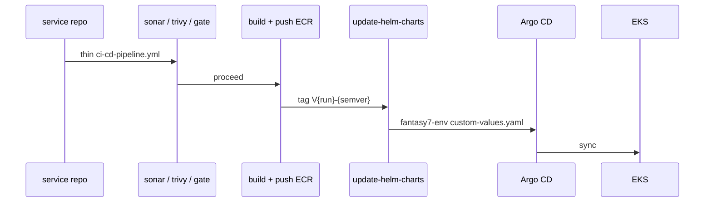
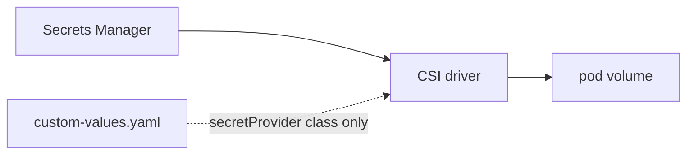

# Compute & deploy

Workloads run on **EKS**. Delivery is **GitOps**: CI pushes an image and a git tag; Argo CD makes the cluster match.



| | Develop + perf | Prod |
|---|---|---|
| Cluster | `rfe-dev-cluster` | `rfe-prod-cluster` |
| Version / mode | 1.35 Auto Mode | 1.35 Auto Mode |
| App ns | `development` / `performance` | `production` |

```bash
aws eks update-kubeconfig --name rfe-dev-cluster --region eu-west-2 \
  --role-arn arn:aws:iam::460195068944:role/rfe-dev-cluster-admin-role \
  --alias rfe-dev-developer
```

## Two layers



**Platform:** develop gets the full add-on set (plus Kubecost / Chaos / k6). Prod is the production subset. Perf does **not** reinstall Traefik/Groundcover — they already run on the shared cluster.

**Services:** one Application per name in the ApplicationSet. Chart `1.0.0`. Health: `/livez` `/readyz`.

Prod list: `userservice` `bettingengine` `betfairstreaming` `bookmakerdata` `fancydata` `casinomanagement` `livescore` `livetv` `manualdatamanagement` `frontmarket` `backoffice` `bets` `frontend-b2b` `frontend-b2c` `dataaggregator` `markets`.



## Commit → pod



| Branch | ECR | GitOps folder |
|---|---|---|
| `main` | `{service}-develop` | `fantasy7-develop/` |
| `performance` | `{service}-perf` | `fantasy7-perf/` |
| `release/vX.Y.Z` | `{service}-prod` | `fantasy7-prod/` |

Never tag `latest`. Rollback = revert the GitOps commit (`rollback.yml`), not `kubectl rollout undo`.

**Walk the ship path:** Service `ci-cd-pipeline.yml` only *calls* `rfetech-github-actions`. After the quality gate, CI pushes `{service}-{env}:V{run}-{semver}` and commits `deployment.image.tag` under `fantasy7-<env>`. Argo’s ApplicationSet already renders chart `1.0.0` into the env namespace. Lambdas are SAM, not this path. Hop-by-hop: [Visual map § code change](/infra/diagrams#3-a-code-change).

Coordinated releases: “The Big Bash” / “The Patch” / `ship-release.yml`.

## Secrets



No credentials in Helm values. PreSync jobs wait until SecretProviderClass exists.

**Not GitOps:** settlement Lambdas (`build-lambda.yml`). Heat-event scale: `scale-data-plane.yml`.

Local: `falconx-local-dev:latest` + `make redeploy`. No Argo on a laptop.

[Visual map](/infra/diagrams)
