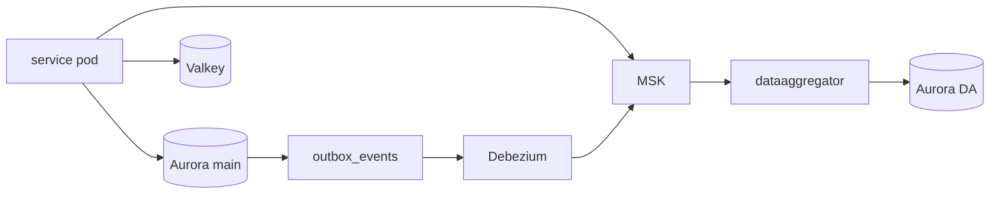
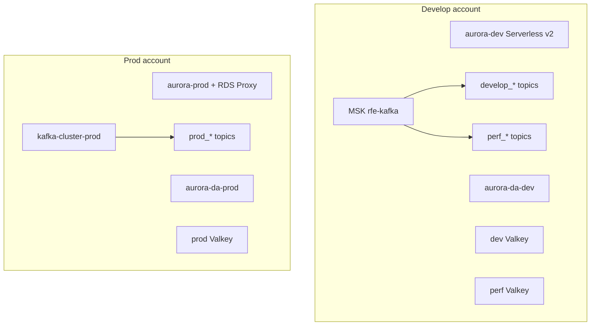
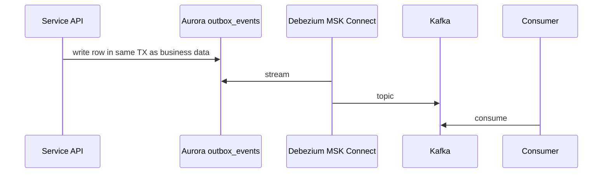
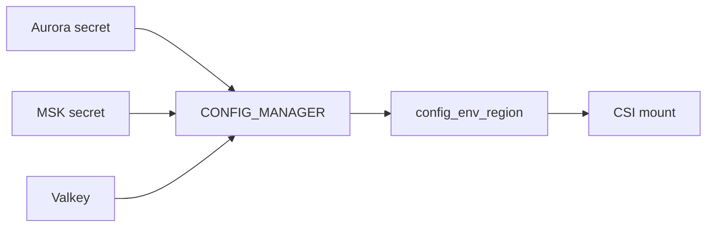

# Data stores

OLTP on **Aurora** (database per service). Cache on **Valkey**. Async on **MSK**. CDC via **Debezium** outbox. Second Aurora for Data Aggregator.

## Cloud vs local

| Store | Local | Cloud |
|---|---|---|
| Postgres | `:5432` | Aurora PG 17 |
| Replica | `:5433` if `REPLICA=1` | Aurora reader / prod RDS Proxy |
| Redis | `:6379` cluster-mode | ElastiCache Valkey 9 cluster-mode |
| Kafka | `:9092` | MSK 3.9 KRaft, SCRAM + IAM |
| AWS APIs | LocalStack `:4566` | real AWS |
| Config | compose env | Secrets Manager `config_{env}_{region}` |

Local Redis is cluster-enabled on purpose so CROSSSLOT fails early. Local GlitchTip needs **its own** Redis — not the app one.

## Aurora + Valkey + Kafka

Perf **shares** develop Aurora + MSK. It has **its own** Valkey and Debezium connectors.

Topics are Terraform (`KAFKA` module), not created by apps at boot.

## Outbox CDC

Connectors: **userservice**, **bettingengine**, **casinomanagement**. Name: `{env}-{service}-outbox-connector`.

**Walk the CDC path:** The API writes business data and `outbox_events` in one Postgres transaction. Debezium on MSK Connect tails that table and publishes to Terraform-managed topics (`develop_*` / `perf_*` on shared MSK, `prod_*` on prod). DataAggregator consumes and writes **aurora-da**. BettingEngine also produces some topics itself. Perf shares develop’s Aurora/MSK but has its own connectors and Valkey. Hop-by-hop: [Visual map § data plane](/infra/diagrams#7-data-plane).

## Config and pools

DB/Redis pools are a **fleet budget** (`rfetech-gitops/.github/connection-budget/`). Scale on `db_pool_*` / `redis_pool_*`, not “CPU looks fine”.

EventBridge `bus_{env}` is for market-closure style events. Vendors (Betfair, datafeed365, …): [Dependencies](/infra/dependencies). Secret names: [IAM & secrets](/infra/iam-and-secrets).

Kafka lag / pool exhaustion: [Troubleshooting](/infra/troubleshooting). Topic or cluster size: [Changes](/infra/changes).

[Visual map](/infra/diagrams)
