# Visual map

Skim this page first. Each diagram is one idea. Captions are short on purpose.

**Want the repo-by-repo detail?** [Four repos](/infra/repos/) · [Creating things](/infra/repos/creating)

The three flows to learn first: **[request](#2-a-user-request)** · **[ship](#3-a-code-change)** · **[data / CDC](#7-data-plane)**. Plus **[infra change](#13-an-infrastructure-change)** and the **[cloud tree](#0-cloud-layout)**. Each diagram has a short “when to look” note.

## 0. Cloud layout

**What:** One tree of the AWS account as we actually run it. **When to look:** first hour on the team. **Notice:** perf is a namespace under develop’s cluster, not a third account. WAF/CloudFront certs are us-east-1; the VPC is eu-west-2.

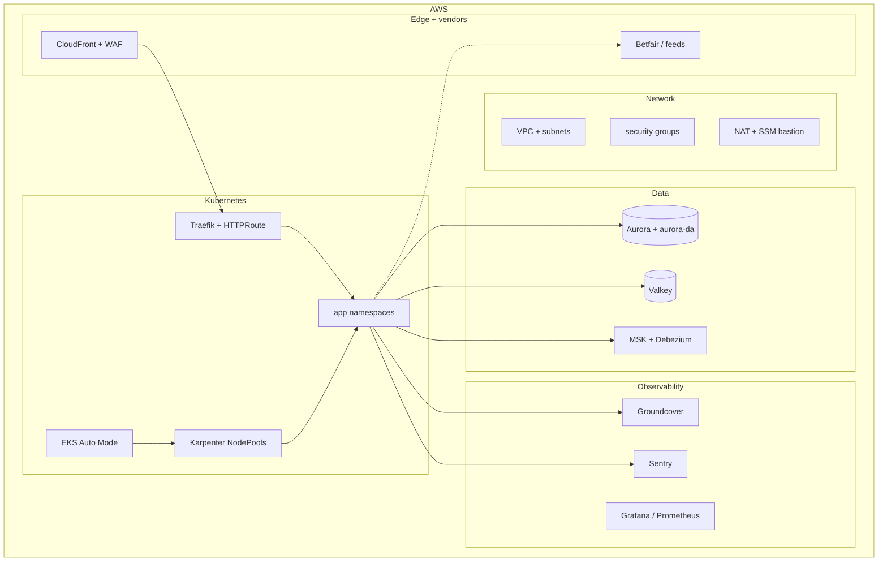

Interactive: [C4 workspace](/c4/) · narrative: [Overview](/infra/)

---

## 1. The whole system

**What:** Four Git repos around one region. **When to look:** after the cloud tree, before diving into a single hop.

Four repos. One AWS region (`eu-west-2`). Traffic in from the left, code in from the top.

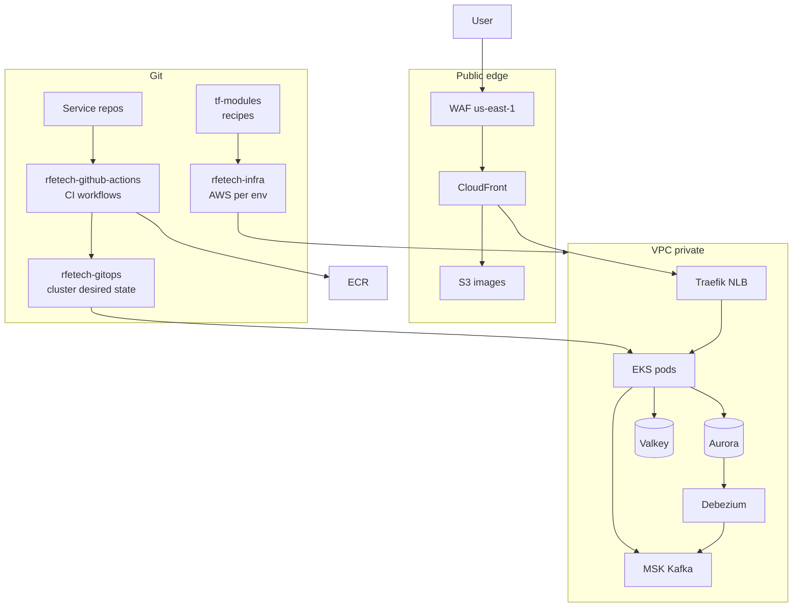

[Overview](/infra/) · [Provisioning](/infra/provisioning) · [Compute & deploy](/infra/compute-and-deploy)

---

## 2. A user request

The browser never talks to a Kubernetes pod. DNS for `bigbash.site` / `bigbash.life` points at **CloudFront**. WAF is attached to that distribution (it must live in **us-east-1**). After WAF, CloudFront either serves a **cached file from S3** or forwards into the VPC.

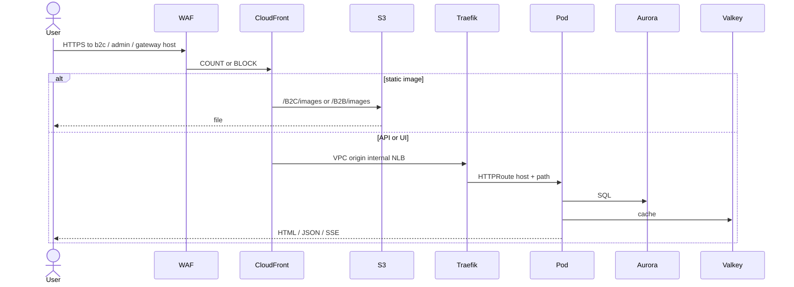

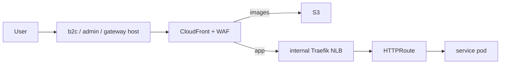

**Hop by hop**

1. **DNS** — Prod: `bigbash.site` (B2C), `admin.bigbash.site` (B2B), `gateway-prod.bigbash.site` (APIs). Develop/perf: same three roles on `bigbash.life` with `-develop` / `-perf`. ExternalDNS keeps Route53 in sync from HTTPRoute hostnames.
2. **WAF** — Rate limits (gateway vs B2C vs B2B, auth vs anonymous, global ceiling), AWS managed rules, optional maintenance kill-switch. **COUNT** = log only (develop/prod today). **BLOCK** = enforce (perf). A 403 here never reached Traefik.
3. **CloudFront** — Terminates TLS. Path `/B2C/images/*` and `/B2B/images/*` go to S3 + OAC. Everything else is a **VPC origin** to an **internal** NLB (not on the public internet).
4. **Traefik CloudFront** — In namespace `traefik-cloudfront`. Gateway API `HTTPRoute` matches **host + path** (example: `gateway-prod.bigbash.site` `/frontmarket` → FrontMarket). A second Traefik (`traefik-external`) is for Grafana and tools, not this public product path.
5. **Pod** — ClusterIP Service. Reads Aurora and/or Valkey. Response goes back the same way. There is no service mesh.

If this hop fails, see [Networking](/infra/networking). Interactive C4: **Infra — Request path**.

---

## 3. A code change

Nobody `kubectl apply`s product apps. The service repo calls **reusable workflows**. Those workflows push an image and **commit a tag in GitOps**. Argo CD is the only thing that talks to the Kubernetes API for that deploy.

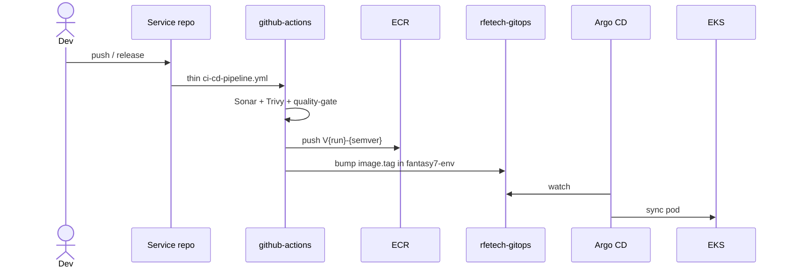

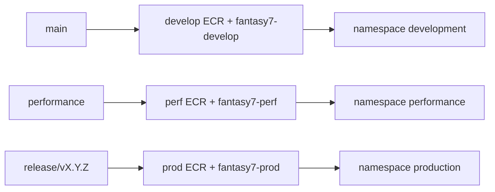

**Hop by hop**

1. **Push** — `main` → develop, `performance` → perf, `release/vX.Y.Z` → prod. Manual deploys also check branch + `infra-team`.
2. **Qualify** — `sonar.yml` + `trivy-fs-scan.yml` (+ lint). `quality-gate.yml` sets `proceed`. A reusable-workflow crash must not hide other checks — keep extra tests in a **sibling** workflow.
3. **Build** — `extract-version.yml` makes tag **`V{run}-{semver}`** (never `latest`). `build-docker-image.yml` Buildx + image scan; `push-ecr-image.yml` writes `{service}-{develop|perf|prod}` in ECR `eu-west-2`.
4. **GitOps** — `update-helm-charts.yml` sets `deployment.image.tag` in `helm-overrides/fantasy7-<env>/<service>/custom-values.yaml` (rebase retry if two ships collide).
5. **Argo CD** — ApplicationSet already points that folder at chart `helm-templates/1.0.0`. It syncs the Deployment in `development` / `performance` / `production`. Rollback = **revert that GitOps commit**, not `kubectl rollout undo`.

Settlement Lambdas skip this path (`build-lambda.yml` / SAM). C4: **Infra — Ship path**.

[Compute & deploy](/infra/compute-and-deploy) · [Environments](/infra/environments) · [Creating things](/infra/repos/creating)

---

## 4. Where code runs

Perf is **not** a third AWS account. It is a namespace on the develop cluster, plus a few overlay stacks.

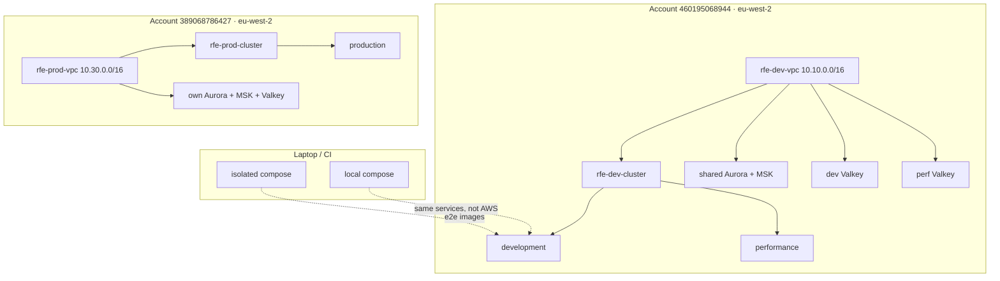

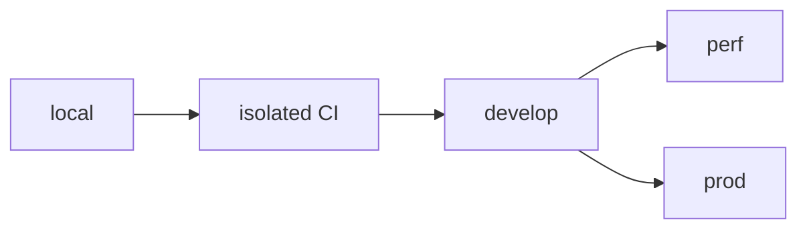

[Environments](/infra/environments)

---

## 5. How AWS is built

`tf-modules` = recipe. `rfetech-infra` = this environment's sizes. GitOps = what runs on the cluster after the seed exists.

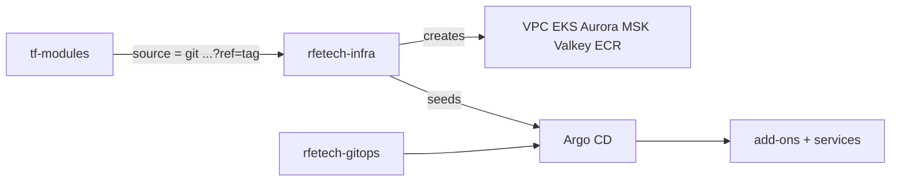

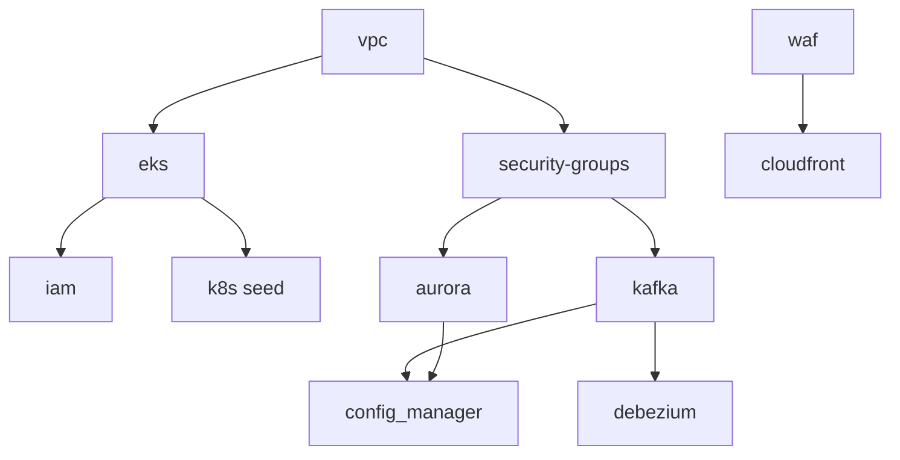

Develop = many small folders. Perf = overlays only. Prod = one core stack + `k8s/`.

[Provisioning](/infra/provisioning)

---

## 6. Inside the VPC

Public subnet: NAT + SSM bastion only. Data stores have no public IP.

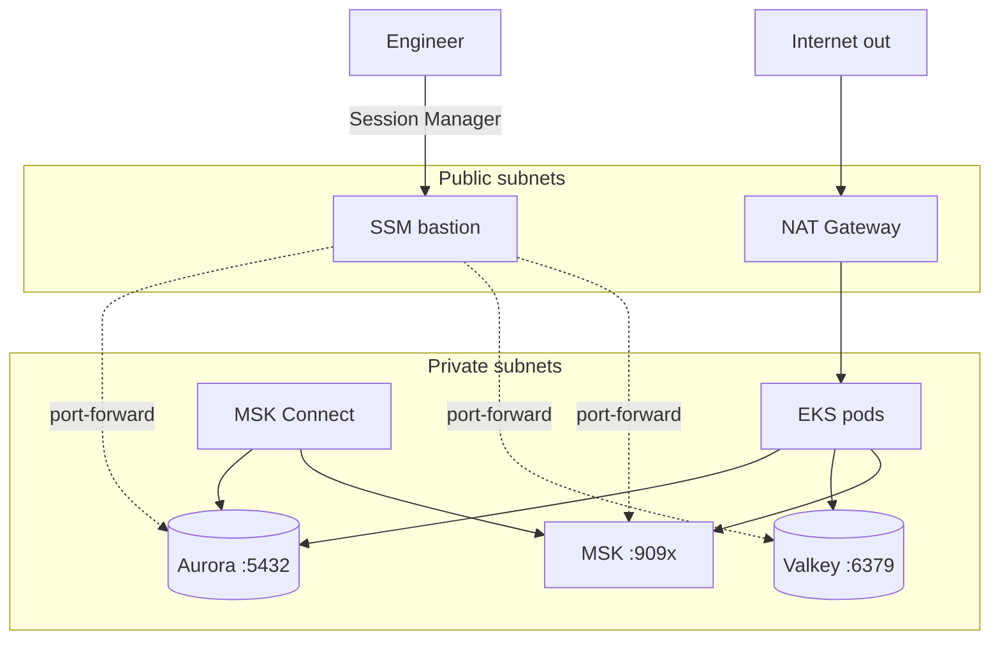

[Networking](/infra/networking) · [Data stores](/infra/data-stores)

---

## 7. Data plane

Synchronous work is SQL + cache. Asynchronous work is **Kafka**. Three services also write an **outbox table in the same Postgres transaction** as the business row. Debezium (MSK Connect) copies those rows to Kafka so consumers like DataAggregator **never poll OLTP**.

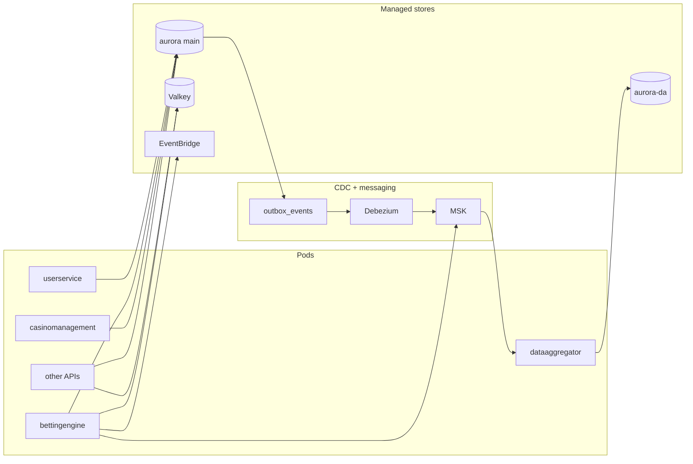

**Hop by hop**

1. **API** — e.g. BettingEngine writes the bet **and** an `outbox_events` row in one transaction on **aurora main** (database/schema per service).
2. **Debezium** — Connector `{env}-{service}-outbox-connector` for **userservice**, **bettingengine**, **casinomanagement**. Plugin ZIP on env S3. Needs `rds.logical_replication=1`.
3. **MSK** — Topics are Terraform, prefix `develop_*` / `perf_*` on shared `rfe-kafka`, `prod_*` on prod. Families include `bet_placed`, `market_settlement`, `user_sync`, plus `failed_*` and `dlq_*` twins. Apps do not auto-create topics.
4. **Consumer** — DataAggregator reads Kafka and writes **aurora-da**. Other consumers subscribe to domain topics BettingEngine produces directly (not only CDC).
5. **Cache / bus** — Valkey is odds, sessions, pub/sub (cluster-mode). EventBridge `bus_{env}` is market-closure style events, not the main bet bus.
6. **Sharing** — Perf **shares** develop Aurora + MSK (different topic prefix + own Debezium + own Valkey). Prod shares nothing.

C4: **Infra — Data plane**. Detail: [Data stores](/infra/data-stores).

---

## 8. GitOps on the cluster

Two roots per environment. Left = platform. Right = BigBash services.

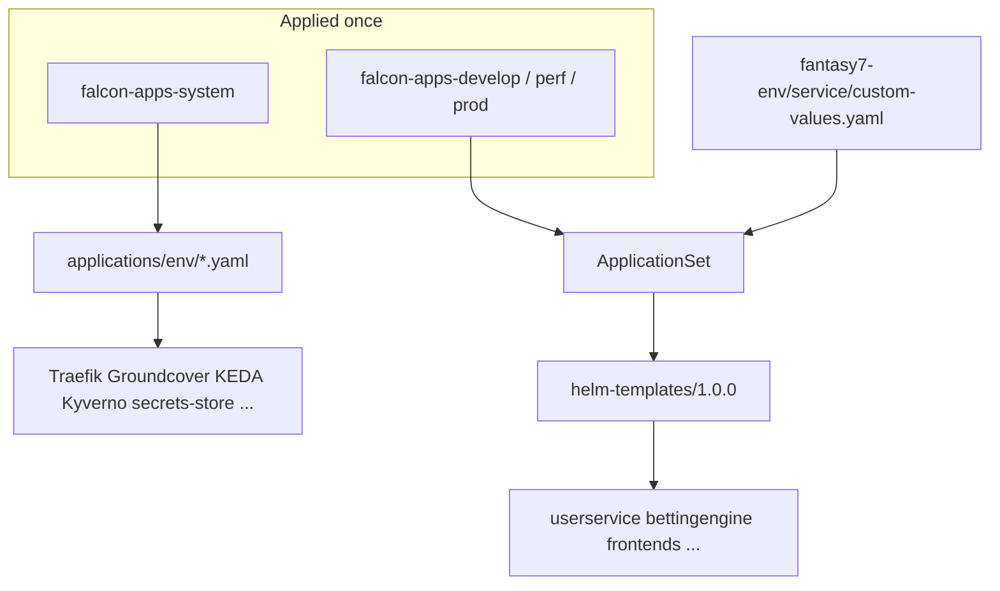

[Compute & deploy](/infra/compute-and-deploy)

---

## 9. Secrets

**What:** How pods get DB/Kafka/Valkey settings. **When to look:** CrashLoop on mount, or a new env key. Detail: [IAM & secrets](/infra/iam-and-secrets).

Credentials never live in Helm values. Config Manager builds one Secrets Manager document. CSI mounts it into the pod.

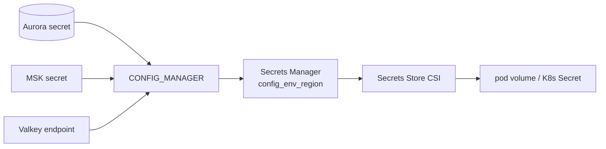

[Compute & deploy](/infra/compute-and-deploy)

---

## 10. Observability

Groundcover is the cloud default. Sentry is errors. Prometheus is HPA CPU/memory. Local is GlitchTip + optional OTel.

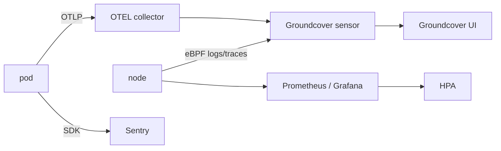

[Observability](/infra/observability)

---

## 11. Local vs cloud

Same services. Different everything else.

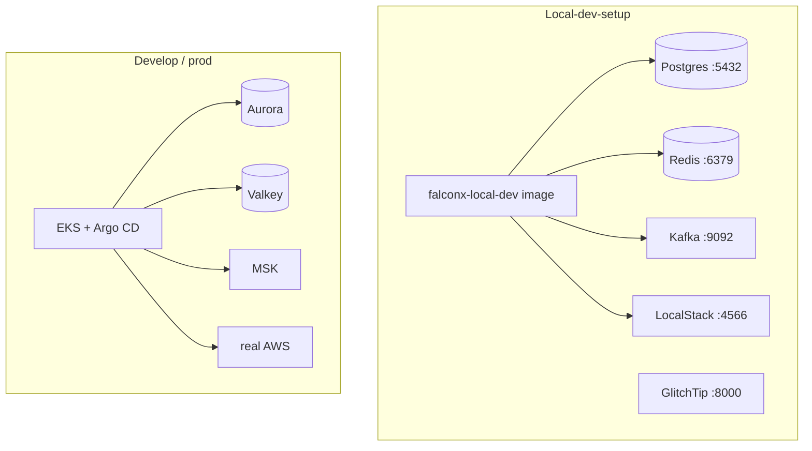

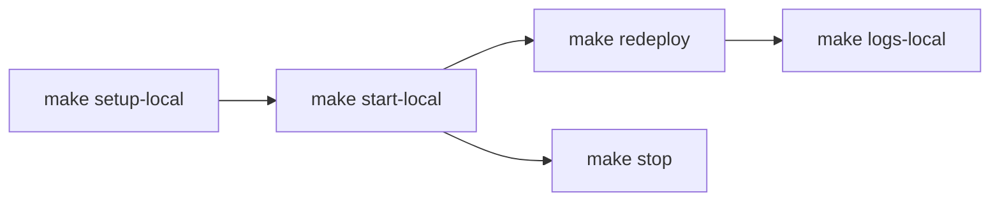

[Local & isolated stack](/infra/local-stack)

---

## 12. Where to edit

**What:** Decision tree for which GitHub repo owns the change. **When to look:** before you open a PR. Full table: [Where to change](/infra/changes).

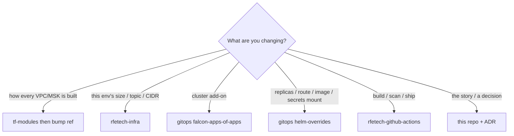

---

## 13. An infrastructure change

**What:** How Terraform or GitOps reaches AWS/the cluster. **When to look:** you are not shipping an app image. **Notice:** prod Terraform is the **manual** `github-aws-int.yaml` workflow (`workflow_dispatch`) with **infra-team** approval. Image-only deploys skip this — they are flow 3.

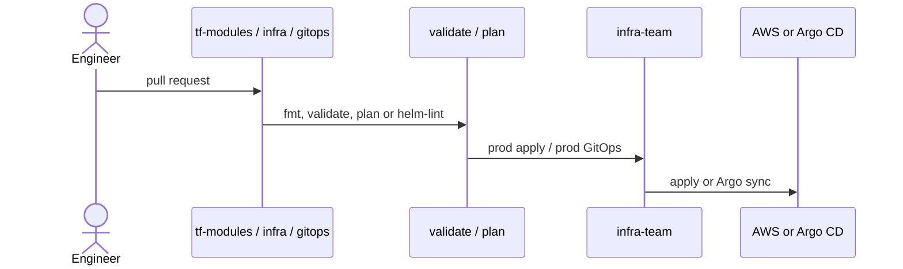

```text
Infra code → PR → review → CI (plan / helm-validate)
  → develop: apply in the leaf folder, or merge GitOps for Argo
  → prod: github-aws-int.yaml (workflow_dispatch: plan → approval → apply) or GitOps + infra-team
  → Cloud / cluster
```

Hop-by-hop: [Changes](/infra/changes). C4: **Infra — Kubernetes compute** (nodes) · **Infra — Ship path** (apps).
