# Visual map

Skim this page first. Each diagram is one idea. Captions are short on purpose.

**Want the repo-by-repo detail** (every Terraform stack, Argo add-on, CI workflow)? Start at [Four repos](/infra/repos/).

## 1. The whole system

Four repos. One AWS region (`eu-west-2`). Traffic in from the left, code in from the top.

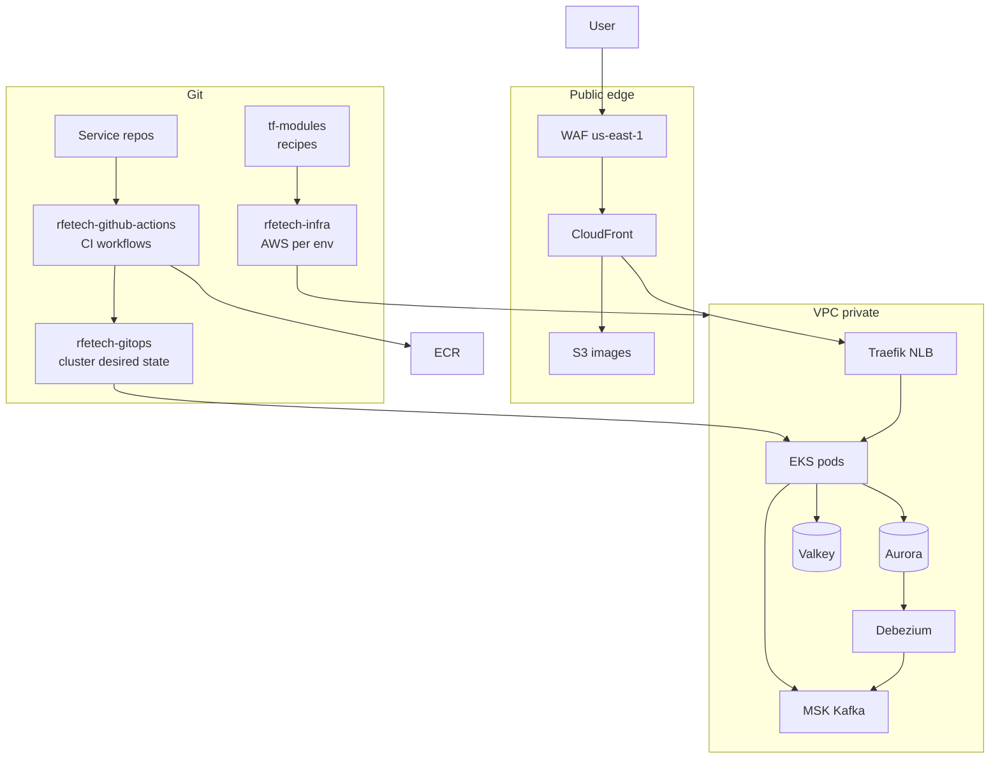

[Overview](/infra/) · [Provisioning](/infra/provisioning) · [Compute & deploy](/infra/compute-and-deploy)

---

## 2. A user request

Browser never talks to a pod. CloudFront is the front door. Static images stop at S3.

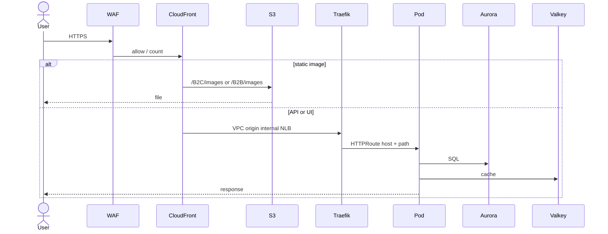

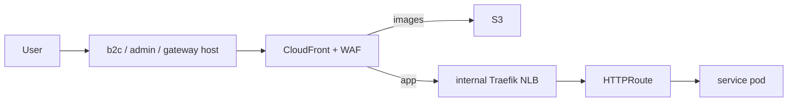

Prod hosts: `bigbash.site` (B2C), `admin.bigbash.site` (B2B), `gateway-prod.bigbash.site` (APIs). Develop/perf use the same roles on `bigbash.life`.

[Networking](/infra/networking)

---

## 3. A code change

No `kubectl apply`. CI writes git. Argo CD copies git onto the cluster.

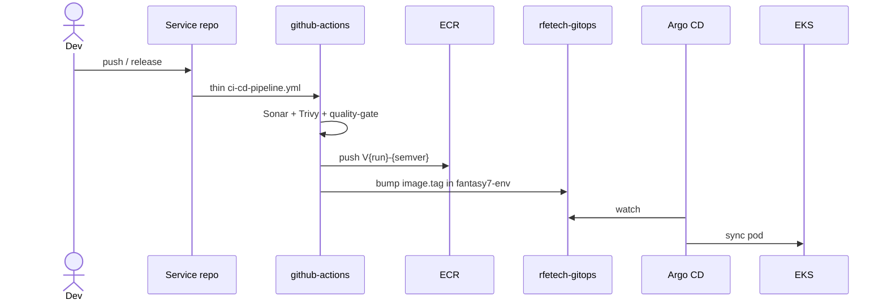

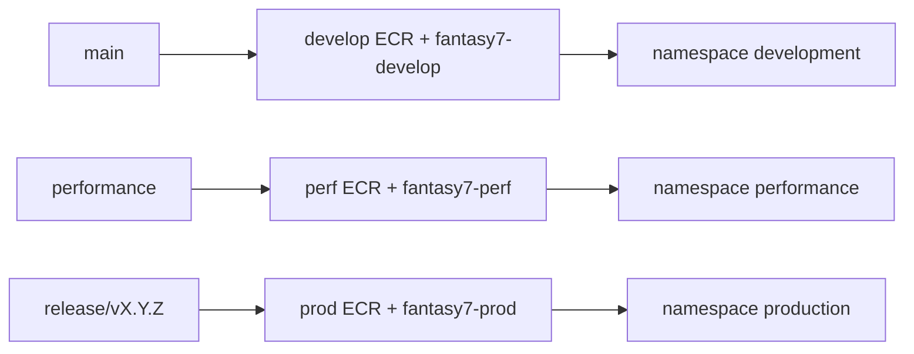

[Compute & deploy](/infra/compute-and-deploy) · [Environments](/infra/environments)

---

## 4. Where code runs

Perf is **not** a third AWS account. It is a namespace on the develop cluster, plus a few overlay stacks.

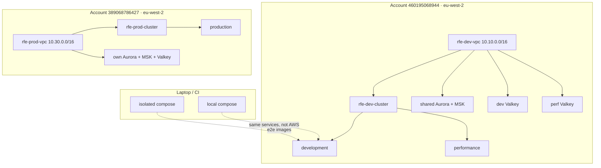

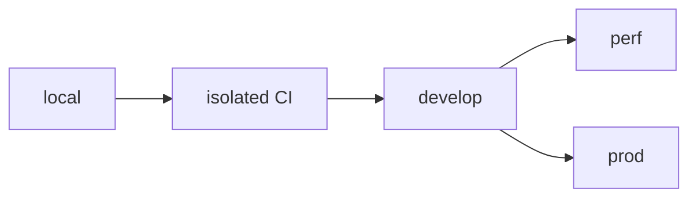

[Environments](/infra/environments)

---

## 5. How AWS is built

`tf-modules` = recipe. `rfetech-infra` = this environment's sizes. GitOps = what runs on the cluster after the seed exists.

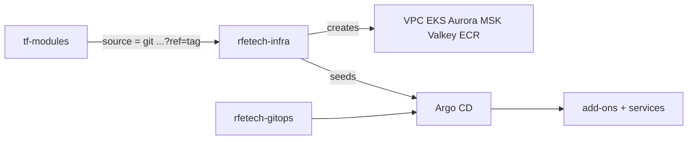

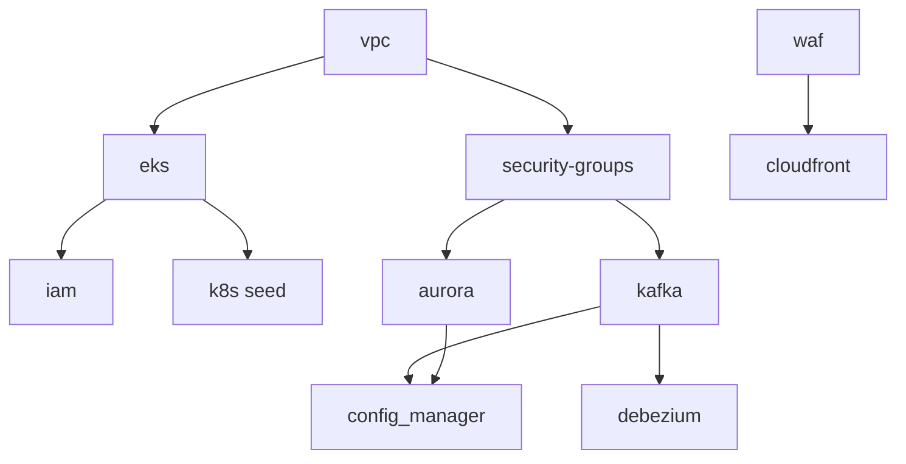

Develop = many small folders. Perf = overlays only. Prod = one core stack + `k8s/`.

[Provisioning](/infra/provisioning)

---

## 6. Inside the VPC

Public subnet: NAT + SSM bastion only. Data stores have no public IP.

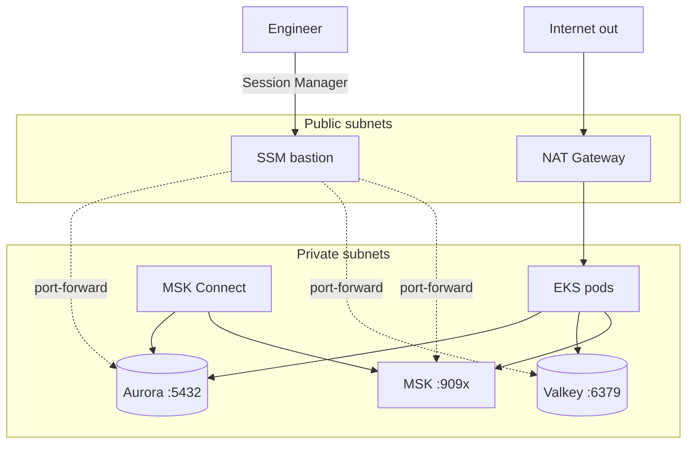

[Networking](/infra/networking) · [Data stores](/infra/data-stores)

---

## 7. Data plane

One Aurora for OLTP (database per service). Second Aurora for Data Aggregator. Kafka for async. Debezium copies outbox rows so consumers never poll OLTP.

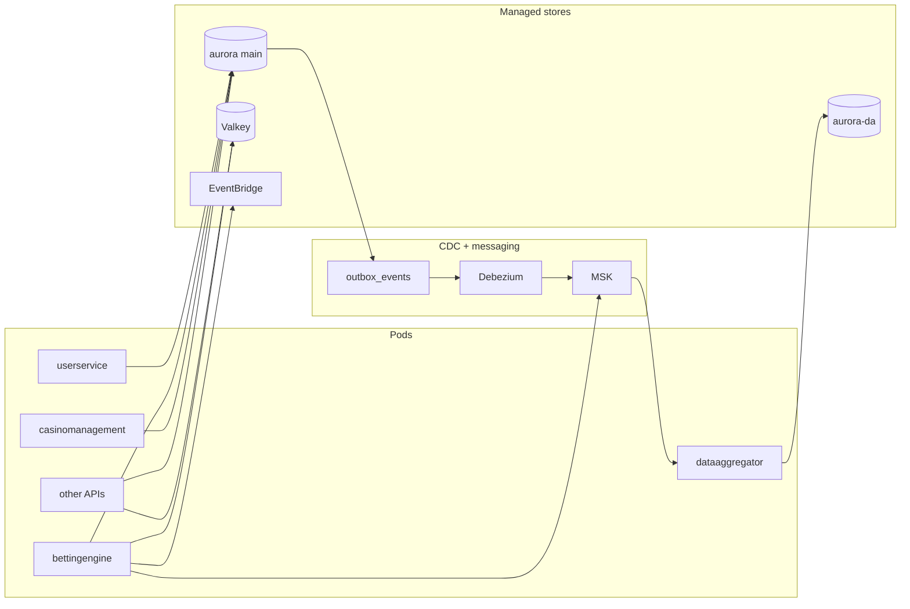

Connectors: userservice, bettingengine, casinomanagement. Topic prefixes: `develop_*` / `perf_*` on the **same** MSK cluster; `prod_*` on prod MSK.

[Data stores](/infra/data-stores)

---

## 8. GitOps on the cluster

Two roots per environment. Left = platform. Right = BigBash services.

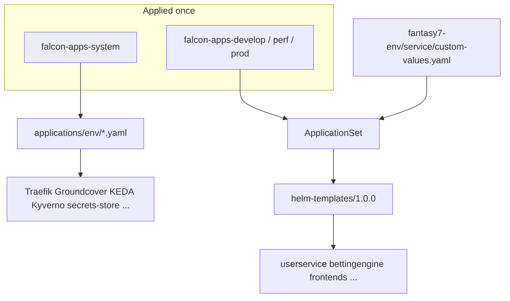

[Compute & deploy](/infra/compute-and-deploy)

---

## 9. Secrets

Credentials never live in Helm values. Config Manager builds one Secrets Manager document. CSI mounts it into the pod.

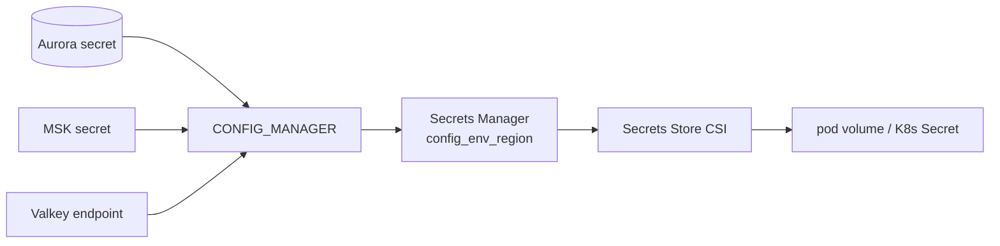

[Compute & deploy](/infra/compute-and-deploy)

---

## 10. Observability

Groundcover is the cloud default. Sentry is errors. Prometheus is HPA CPU/memory. Local is GlitchTip + optional OTel.

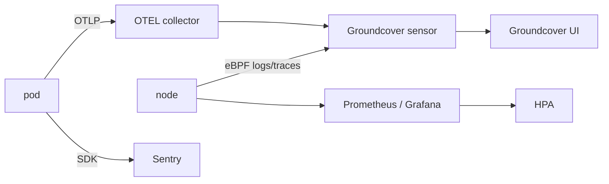

[Observability](/infra/observability)

---

## 11. Local vs cloud

Same services. Different everything else.

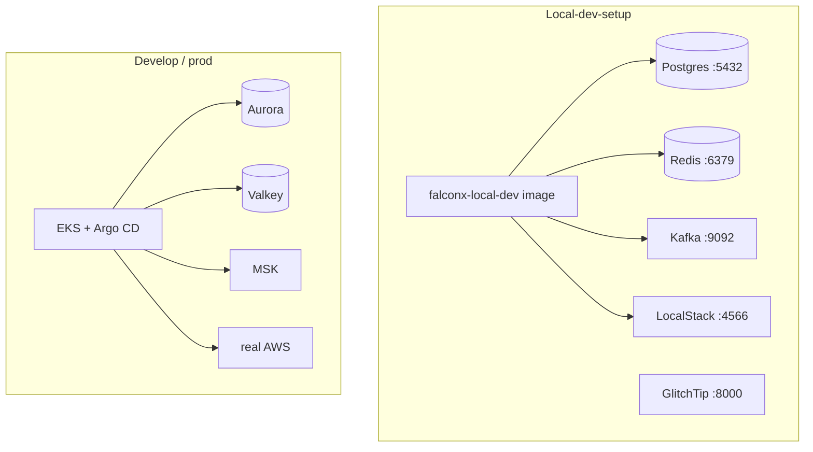

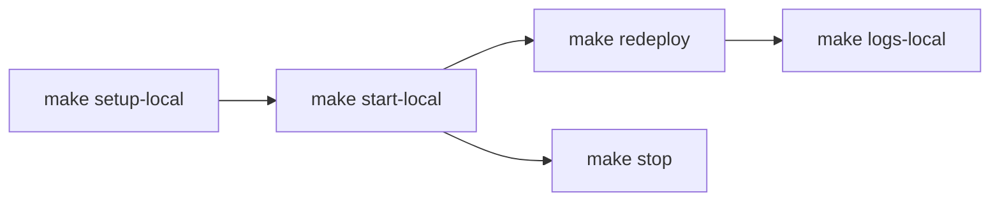

[Local & isolated stack](/infra/local-stack)

---

## 12. Where to edit

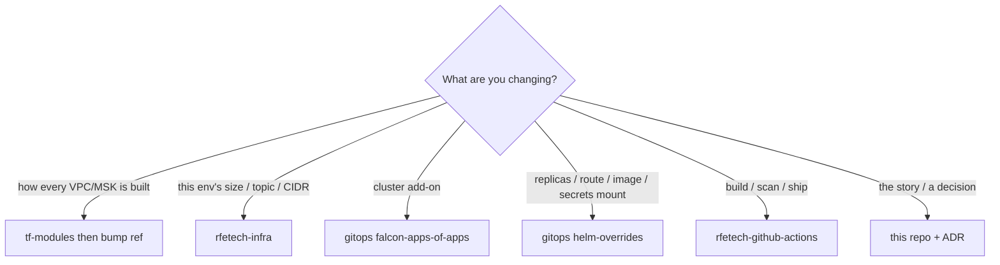
