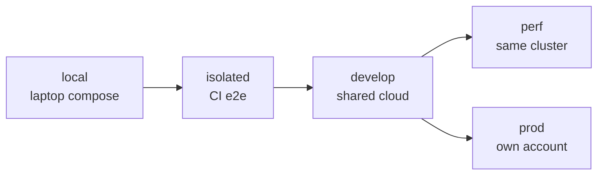
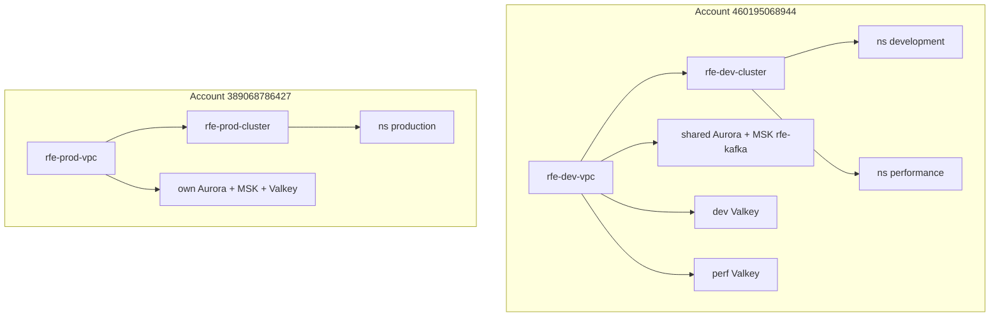
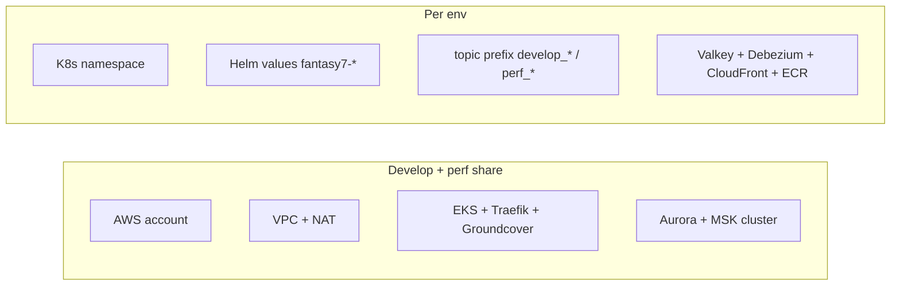
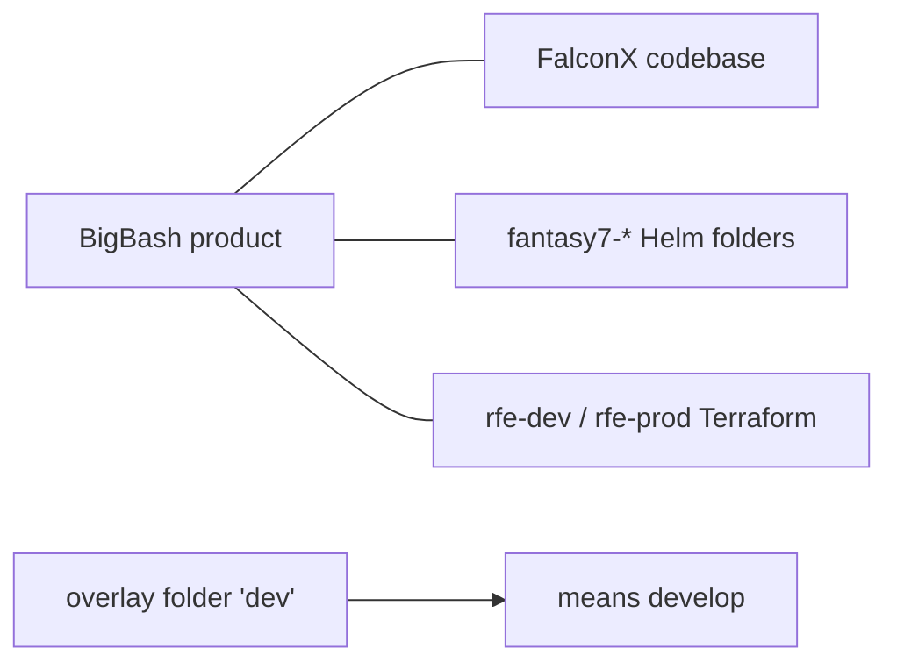
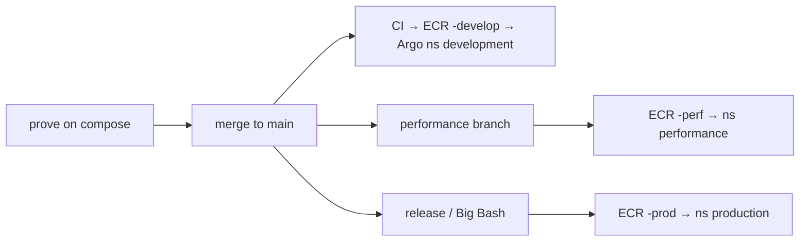

# Environments

Five places code runs. Three are cloud. Two are compose.

| Env | Runs on |
|---|---|
| **local** | Docker Compose (`Local-dev-setup`) |
| **isolated** | Same topology, pre-built images |
| **develop** | Account `460195068944`, cluster `rfe-dev-cluster`, ns `development` |
| **perf** | **Same account + cluster**, ns `performance` |
| **prod** | Account `389068786427`, cluster `rfe-prod-cluster`, ns `production` |

Region: **`eu-west-2`**. WAF + CloudFront certs: **`us-east-1`**.

## Shared vs isolated

Perf is a namespace and a few overlays — not a copy of prod.

| | Develop | Perf | Prod |
|---|---|---|---|
| Domain | `*.bigbash.life` | `*.bigbash.life` | `bigbash.site` |
| Hosts | `b2c-develop` `b2b-develop` `gateway-develop` | `*-perf` | `bigbash.site` `admin` `gateway-prod` |
| GitOps | `fantasy7-develop/` | `fantasy7-perf/` | `fantasy7-prod/` |

## Names in git

## Promotion

Autoscaling is forced **off** in develop and perf ApplicationSets. Prod uses HPA.

[Visual map](/infra/diagrams) · [Compute & deploy](/infra/compute-and-deploy)
