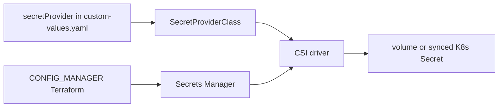

# IAM and secrets

No long-lived database passwords in Git. Humans assume **IAM roles**. Pods use **EKS Pod Identity** (and some IRSA) to read **AWS Secrets Manager**. Helm `custom-values.yaml` may name *which* secret to mount, never the secret value.

## Human access

| Role (pattern) | Purpose |
|---|---|
| `{cluster}-admin-role` | Cluster admin, kubeconfig example on [Kubernetes](/infra/kubernetes) |
| `{cluster}-developer-role` | Day-to-day kubectl |
| `{cluster}-poweruser-role` | Broader AWS in that account |
| Groups `administrator` / `developers` / `power-user` | IAM groups in develop `iam/` |

Configured in `rfetech-infra` `rfe-dev/iam/` and prod `main.tf` (EKS Access Entries). Prod Terraform apply assumes `IAC_Role` in account `389068786427`.

**Bastion:** SSM Session Manager only (no SSH keys). Port-forward to Aurora `5432`, Valkey `6379`, Kafka TLS ports. Develop: `rfe-dev/bastion-ssm`. Prod: `bastion.tf`.

## Workload identity

| Who | Mechanism | Why |
|---|---|---|
| Secrets Store CSI | EKS Pod Identity | Read Secrets Manager into the pod |
| cert-manager | Pod Identity / IRSA | Route53 DNS-01 certificates |
| external-dns | Pod Identity | Write HTTPRoute hostnames to Route53 |
| KEDA operator | Pod Identity | Scale on SQS / MSK / Prometheus |
| Groundcover control plane | IAM role `groundcover-managed` | Vendor reads AWS metrics (Terraform `rfe-infra/groundcover`) — **not** the in-cluster sensor |

GitHub Actions for **service CI** uses **static AWS access keys** (develop vs `_PROD`) plus `PAT_GITHUB`. Prod core Terraform (`rfetech-github-actions` `github-aws-int.yaml`, **workflow_dispatch**) assumes `IAC_Role` with an external ID. There is **no** GitHub OIDC→AWS for everyday ECR pushes today.

Heat-event scaling: `GitHubActionsEKSRole` / `GitHubActionsScaleDataPlaneRole` + GitOps `scale-data-plane.yml` (Aurora / MSK / ElastiCache / MSK Connect).

## Config Manager (the blob apps read)

Terraform module `CONFIG_MANAGER` builds Secrets Manager documents such as:

| Secret name (pattern) | Contents (keys, not values) |
|---|---|
| `config_{environment}_{region}` | `DATABASE_HOST`, `DATABASE_PORT`, `DATABASE_USER`, `DATABASE_PASSWORD`, `DATABASE_REPLICA_HOST`, `REDIS_HOST`, `REDIS_PORT`, `KAFKA_SERVER_URL`, `AWS_MSK_*`, `AWS_ACCOUNT_ID`, `AWS_DEFAULT_REGION` |
| `aurora-{env}` / `aurora-reader-{env}` | Cluster credentials Config Manager reads |
| `AmazonMSK_kafka-dev` / `AmazonMSK_kafka_prod` | SCRAM |
| `redis_credentials_{env}_{region}` | Cache |

Environments: `develop`, `perf`, `prod` (and `eu-west-2` in the name). Example: `config_develop_eu-west-2`.

**Do not copy values into this repo.**

## How a pod gets the blob

Platform: GitOps `secrets-store` + `secrets-store-provider`. PreSync migration Jobs wait until the SecretProviderClass exists (Argo sync-wave).

To add a **new key** to an existing secret, ops use `rfetech-github-actions` `update-secrets-manager.yml` (or Terraform if Config Manager owns that key). Then the app must read the new field.

## Service IAM user

`service-user-rfe-dev` / `service-user-rfe-prod` exist for integrations that still need access keys. Prefer Pod Identity for in-cluster workloads.

## If secrets fail

Pods CrashLoop with mount errors, or 500s talking to Postgres/Kafka. Check: CSI driver pods, Pod Identity association, secret name in `secretProvider`, Config Manager last apply. Do not “fix” by pasting passwords into Helm.
