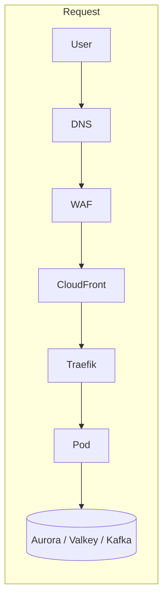
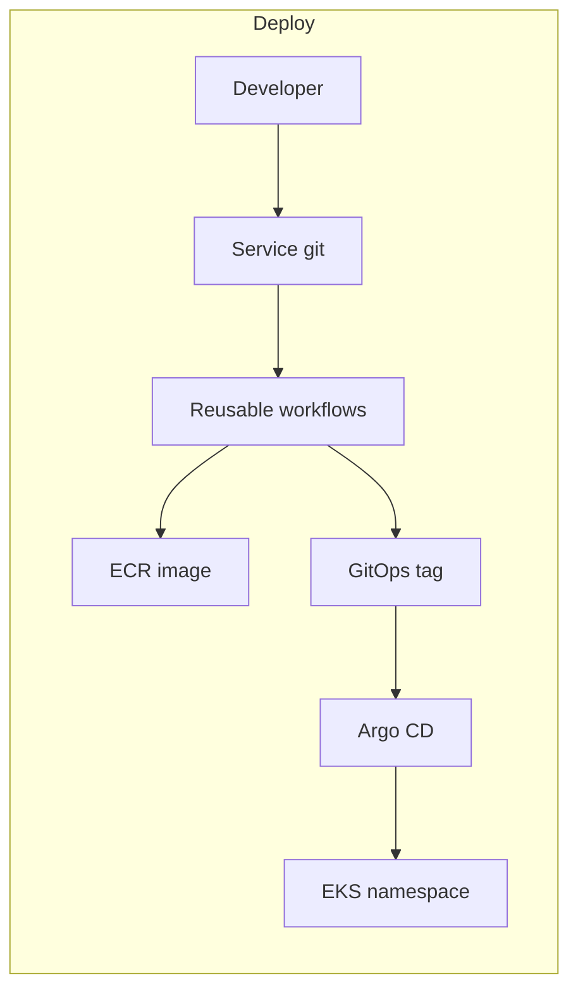
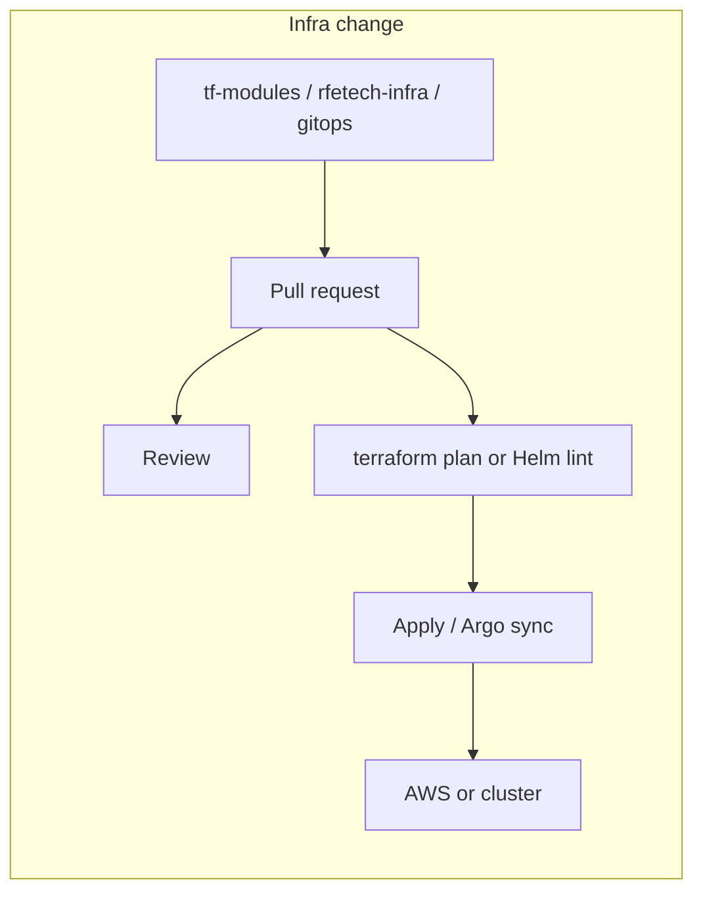

# Infrastructure handbook

This is the **entry point** for how BigBash runs in the cloud. Config (CIDRs, replica counts, image tags, Terraform variables) lives in four GitHub repos. **This site explains.** If a number here and Terraform disagree, Terraform wins — then update this page.

Never paste secrets, passwords, or full Helm values here.

**New here?** Read this page, then the [Visual map](/infra/diagrams) (three flows), then [Where to change](/infra/changes). Interactive pictures: [C4 workspace](/c4/).

## What the system is

**BigBash** is a sports-betting product (customer site + operator admin). **FalconX** is the engineering name for the same platform. Folders named `fantasy7-*` in GitOps are historical; they mean BigBash.

Bettors use the B2C site. Operators use the B2B admin. APIs sit behind a gateway hostname. Odds and catalogue also come from **Betfair** and other third-party feeds.

## Where it runs

| Place | What it is |
|---|---|
| **local** | Docker Compose on a laptop (`Local-dev-setup`) — same *services*, not AWS |
| **isolated** | CI end-to-end compose with pre-built images |
| **develop** | Shared cloud. AWS account `460195068944`, region **eu-west-2** (London). Cluster `rfe-dev-cluster`, namespace `development`. Hosts on `*.bigbash.life` |
| **perf** | Load tests. **Same account and cluster as develop**, namespace `performance`. Own Valkey, Debezium, CloudFront, ECR. Shares Aurora and Kafka with develop |
| **prod** | Live traffic. Separate account `389068786427`, cluster `rfe-prod-cluster`, namespace `production`. Hosts on `bigbash.site` |

WAF and CloudFront certificates live in **us-east-1** because CloudFront requires that. Everything else is eu-west-2.

## How we manage infrastructure

We do **not** click AWS consoles as the source of truth.

| Layer | Repository | Job |
|---|---|---|
| Recipes | `tf-modules` | How a VPC / Aurora / MSK cluster is built |
| This environment | `rfetech-infra` | Sizes, topics, accounts, EKS seed, CloudFront |
| Desired cluster state | `rfetech-gitops` | Traefik, Groundcover, Helm values, image tags |
| Pipelines | `rfetech-github-actions` | Scan, build, push to ECR, bump GitOps |

Amazon Elastic Kubernetes Service (**EKS**) runs the apps. **Argo CD** makes the cluster match git. CI never `kubectl apply`s product apps.

Detail: [Four repos](/infra/repos/) · [Creating things](/infra/repos/creating)

## Main components (why they exist)

| Piece | Why |
|---|---|
| **CloudFront + WAF** | Public HTTPS, caching, rate limits. Pods stay private |
| **Traefik (internal NLB)** | In-cluster ingress. CloudFront VPC origin. Gateway API HTTPRoutes |
| **EKS + Karpenter** | Run containers. Nodes appear when pods need CPU; Auto Mode + NodePools |
| **Aurora PostgreSQL** | System of record (one cluster, database per service). Second cluster for Data Aggregator |
| **Valkey (ElastiCache)** | Redis-compatible cache / pub-sub / sessions |
| **MSK (Kafka) + Debezium** | Async events. Outbox CDC so consumers do not poll OLTP |
| **Secrets Manager + CSI** | One config blob per env; pods mount it. No passwords in Helm |
| **ECR** | Container images `{service}-{develop\|perf\|prod}` |
| **Groundcover + Sentry** | Traces/logs/APM and product errors |
| **SSM bastion** | Break-glass to databases — no public DB ports |

If a piece fails: CloudFront/WAF → users cannot enter. Traefik → 502s. EKS/Karpenter → no capacity. Aurora → writes fail. Valkey → cache/odds degrade. MSK/Debezium → async lag, OLTP still up. Argo CD down → deploys stop, running pods keep serving.

## Four flows

Hop-by-hop (request, ship, outbox CDC): [Visual map](/infra/diagrams). Infra PRs: [Changes](/infra/changes).

## How to read this handbook

| I need… | Page |
|---|---|
| Pictures of every flow | [Visual map](/infra/diagrams) |
| Interactive C4 | [C4](/c4/) |
| Develop vs perf vs prod | [Environments](/infra/environments) |
| VPC, CloudFront, bastion | [Networking](/infra/networking) |
| EKS, Karpenter, nodes | [Kubernetes](/infra/kubernetes) |
| Image tags, Argo, Lambdas | [Compute & deploy](/infra/compute-and-deploy) |
| Aurora, Valkey, Kafka, CDC | [Data stores](/infra/data-stores) |
| IAM, CSI, secret *names* | [IAM & secrets](/infra/iam-and-secrets) |
| Betfair and other vendors | [Dependencies](/infra/dependencies) |
| Metrics, logs, alerts | [Observability](/infra/observability) |
| “Which file do I edit?” | [Changes](/infra/changes) |
| Something is on fire | [Troubleshooting](/infra/troubleshooting) |
| Laptop compose | [Local stack](/infra/local-stack) |

## Production vs not

- **Prod** is a separate AWS account, VPC, EKS cluster, Aurora, MSK, Valkey, CloudFront on `bigbash.site`. HPA is on. Prod GitOps PRs require `infra-team`.
- **Develop** is the shared integration cluster. ApplicationSet **forces HPA/KEDA/PDBs off**.
- **Perf** is not a copy of prod. It is a namespace plus overlays on develop’s VPC/cluster/Aurora/MSK.

## Rules

1. Narrative here; configuration in the four repos.
2. Architecture decision: [ADR](/adr/) here first, then implement.
3. Do not `kubectl apply` product workloads as the happy path.
