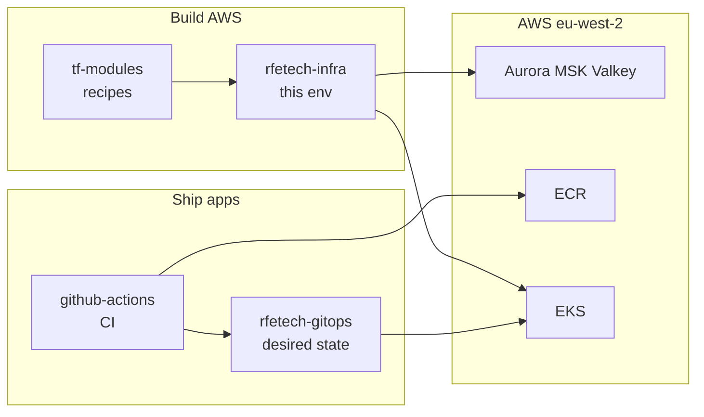
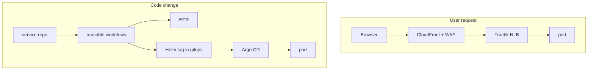

# Infrastructure

How BigBash is hosted, shipped, and operated — **pictures first**.

Config (CIDRs, replica counts, image tags) stays in the four infra repos. This site narrates. If a number here and Terraform disagree, Terraform wins — then update this page. Never paste secrets here.

**Pictures:** [Visual map](/infra/diagrams)  
**Detail by repo:** [Four repos](/infra/repos/) — every Terraform stack, Argo add-on, and CI workflow.

## The four repos

| Repo | Open it when… | Full page |
|---|---|---|
| **tf-modules** | Changing *how* an AWS resource is built for every env | [tf-modules](/infra/repos/tf-modules) |
| **rfetech-infra** | Creating or resizing something in develop / perf / prod | [rfetech-infra](/infra/repos/rfetech-infra) |
| **rfetech-gitops** | Replicas, routes, secret mounts, add-ons, new service | [rfetech-gitops](/infra/repos/rfetech-gitops) |
| **rfetech-github-actions** | Build, scan, or ship behaviour | [github-actions](/infra/repos/rfetech-github-actions) |

Laptop compose is **Local-dev-setup**, not cloud infra. [Local stack](/infra/local-stack).

## Two flows

A **user** hits CloudFront. A **commit** hits CI, then GitOps, then Argo CD. Nobody `kubectl apply`s product apps.

Full sequences: [Visual map](/infra/diagrams) · [Networking](/infra/networking) · [Compute & deploy](/infra/compute-and-deploy)

## Pages

| Page | Question |
|---|---|
| [Visual map](/infra/diagrams) | Show me everything as diagrams |
| [Four repos](/infra/repos/) | What each GitHub repo owns (detailed) |
| [Environments](/infra/environments) | Where does code run? What is shared? |
| [Provisioning](/infra/provisioning) | How is AWS created? |
| [Networking](/infra/networking) | How does traffic enter? |
| [Data stores](/infra/data-stores) | Where is state? |
| [Compute & deploy](/infra/compute-and-deploy) | How does a commit become a pod? |
| [Observability](/infra/observability) | Where do I look when it breaks? |
| [Local & isolated stack](/infra/local-stack) | How do I run it on a laptop? |

Helm folders named `fantasy7-*` mean BigBash. Develop and perf **share an AWS account and cluster**. Prod is a separate account.
