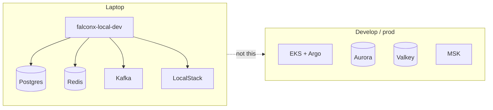
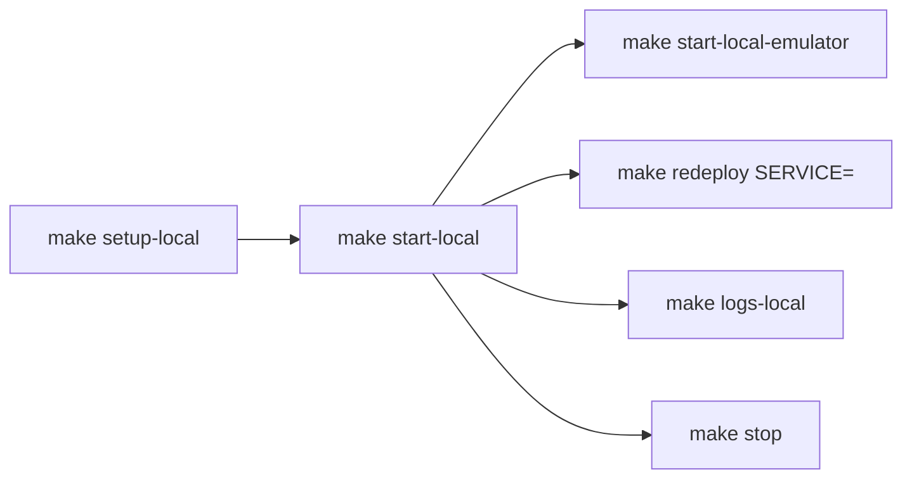
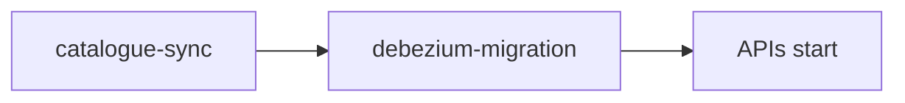

# Local & isolated stack

**Local-dev-setup** runs compose. This docs repo does not. Same *services* as cloud, not the same *AWS*.

No Argo, CloudFront, or Groundcover sensor on a laptop. Flags: `SENTRY=1` `OTEL=1` `REPLICA=1`, plus VPN / fullstack. VPN path: [Networking](/infra/networking).

`depends_on` is real — no sleep barriers. Isolated CI (`make start-isolated*`) is the same topology with pre-built images.

Deep compose rules live in Local-dev-setup, not here.

[Visual map](/infra/diagrams) · [Environments](/infra/environments)
