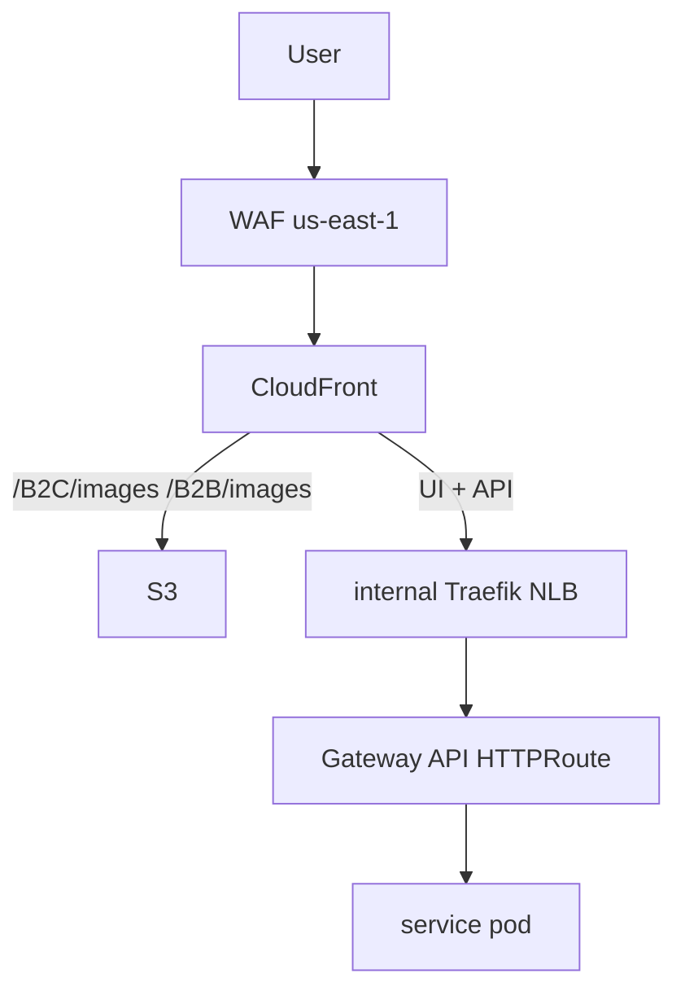
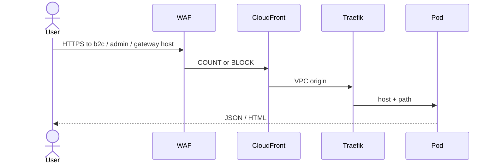
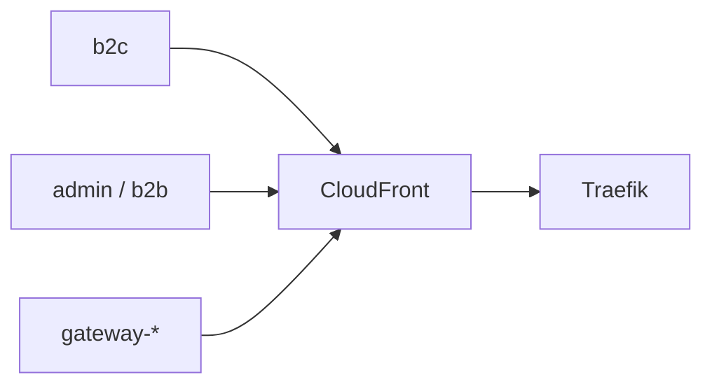
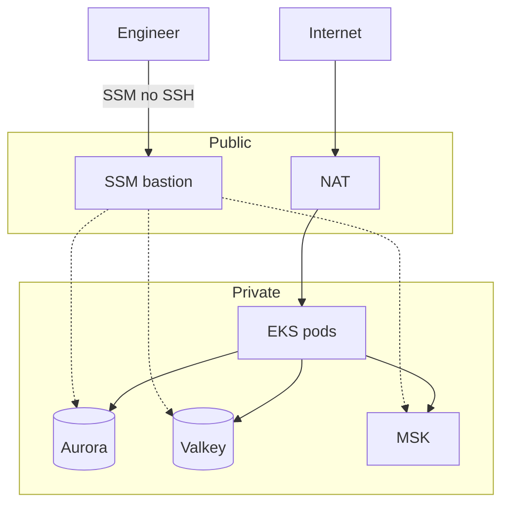
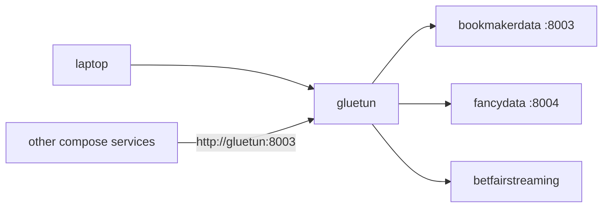

# Networking

Public traffic enters **CloudFront**. Pods stay private. No service mesh.

| Hop | Job |
|---|---|
| WAF | Rate limits, managed rules, kill-switch. ACL in **us-east-1**. |
| CloudFront | TLS, cache, dual origin (S3 + internal NLB). |
| Traefik CloudFront | In-cluster ingress. NLB is **internal**. |
| HTTPRoute | Service declares host + path. ExternalDNS writes Route53. |

WAF: develop/prod **COUNT** (observe), perf **BLOCK**. A second Traefik (`traefik-external`) is for tools (Grafana), not the public product path.

**Walk the request:** DNS hits CloudFront, not a pod. WAF runs in us-east-1. Images (`/B2C/images/*`, `/B2B/images/*`) stop at S3. HTML/API go to an **internal** NLB (`traefik-cloudfront`). An HTTPRoute is host + path in that service’s `custom-values.yaml` — ExternalDNS writes Route53. The pod then uses Aurora/Valkey on private subnets. Hop-by-hop: [Visual map § request](/infra/diagrams#2-a-user-request).

## Hosts

Prod: `bigbash.site`, `admin.bigbash.site`, `gateway-prod.bigbash.site`. Develop/perf: same roles on `bigbash.life` with `-develop` / `-perf`.

## VPC

| | Develop / perf | Prod |
|---|---|---|
| VPC | `rfe-dev-vpc` `10.10.0.0/16` | `rfe-prod-vpc` `10.30.0.0/16` |
| Stores | private, SG from VPC CIDR | same idea, prod CIDR |

Bastion stacks: `rfe-dev/bastion-ssm`, prod `bastion.tf`.

## Local VPN (laptop only)

`make start-local-vpn` puts those services on `network_mode: service:gluetun`. Fullstack B2B/B2C uses `network_mode: host` so SSR and the browser share `localhost`. Deep rules: `Local-dev-setup`.

[Visual map](/infra/diagrams)
