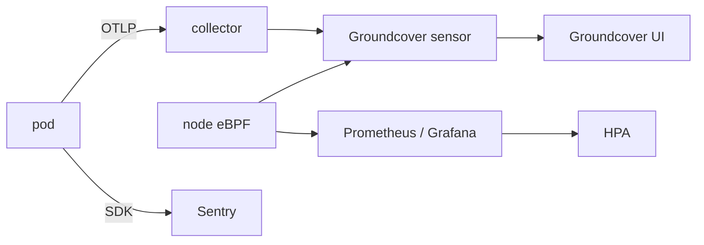
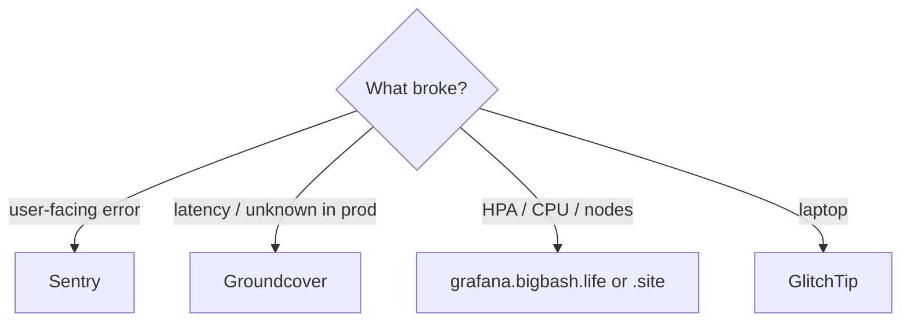
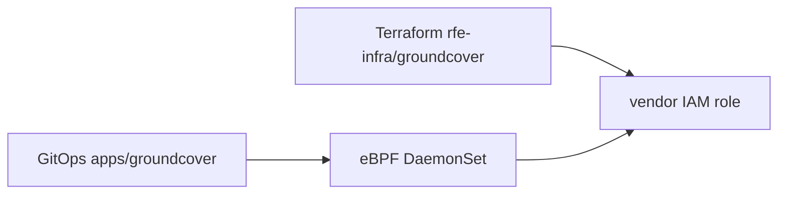

# Observability

Cloud: **Groundcover** first. Errors also in **Sentry**. HPA still needs **Prometheus / metrics-server**.

| Signal | Local | Cloud |
|---|---|---|
| Errors / traces | GlitchTip `SENTRY=1` `:8000` | Sentry + Groundcover |
| Metrics | OTel `OTEL=1` `:8889` | Groundcover + kube-prometheus-stack |
| Logs | `make logs-local` | Groundcover **sensor**, not app-OTLP |

## Where to look

Develop overlay → UI cluster **Development**. Prod → **Production**. Perf has **no extra install** — you watch the develop cluster while load hits ns `performance`.

OTLP **logs** from apps are dropped (`nop`). Logs in Groundcover are from the node sensor. Sampling is low (~5% OTEL).

Grafana sits behind oauth2-proxy: `grafana.bigbash.life` / `grafana.bigbash.site`.

Kubecost + Chaos Mesh: develop only.

**Gotchas:** local OTel is metrics-oriented (traces belong to GlitchTip/Sentry). A zero in GlitchTip is not a pass — CrossSlot on shared Redis looks like “quiet”. Scale on `db_pool_*` / `redis_pool_*`.

CI release traces: `ground-cover-push-traces.yaml`. Inventory: `rfetech-github-actions/docs/RFE-Metrics-Inventory.md`.

[Visual map](/infra/diagrams)
