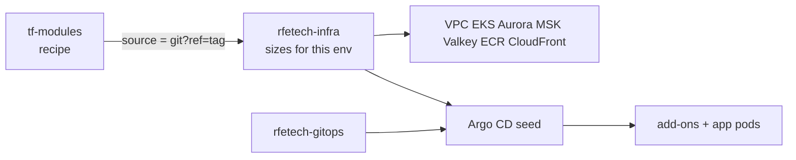
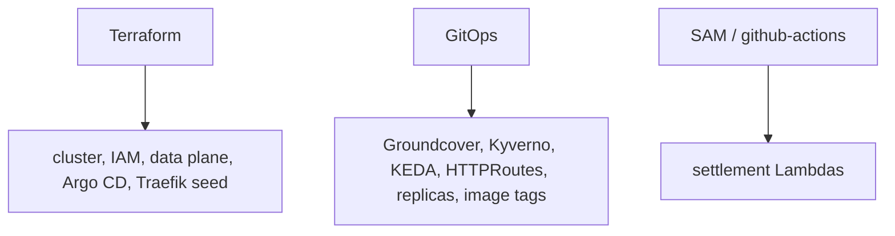
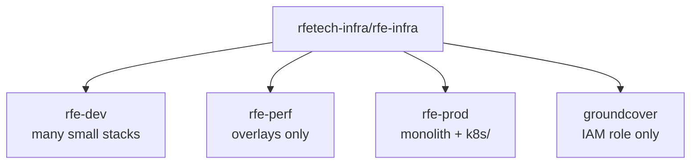
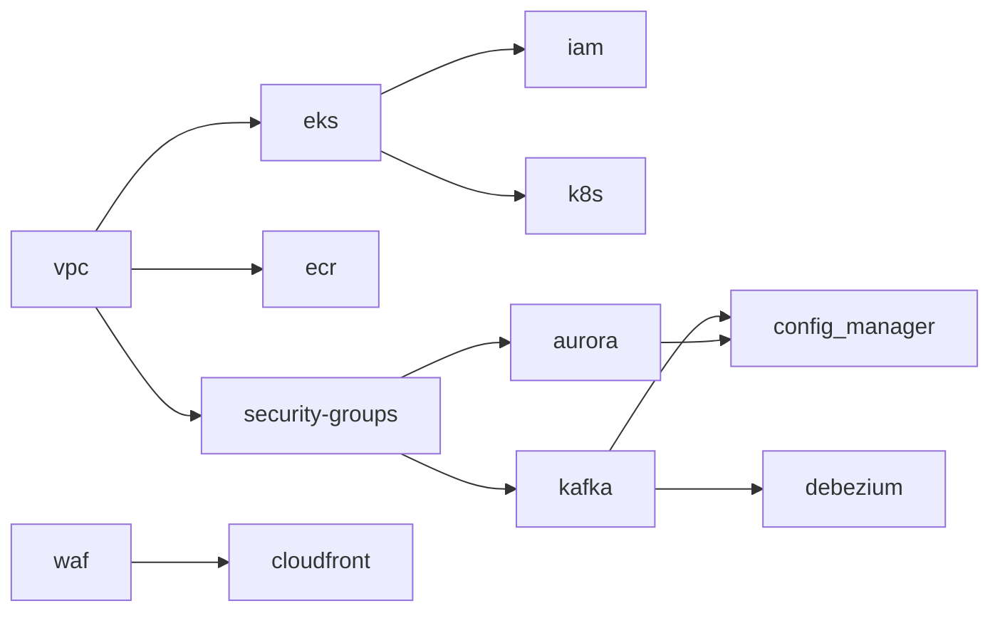
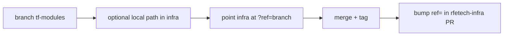

# Provisioning

Terraform builds AWS. Two layers: **library** then **this environment**.



```hcl
source = "git@github.com:rfetechnology/tf-modules.git//modules/AURORA?ref=<tag>"
```

Pin a **tag**. State lives in S3 on the infra stacks, not in `tf-modules`.

## Who owns what



## Layout



| | Develop | Perf | Prod |
|---|---|---|---|
| Shape | one folder = one state | no VPC/EKS/MSK | `main.tf` + `k8s/` |
| State bucket | `rfe-terraform-state` | same | `rfe-infra-terraform-state` |

Ignore `Unwanted/`. No Terraform workspaces.

## Apply order (develop)



Plan in the **leaf**. If a plan wants to create a VPC, you are in the wrong folder.

**Modules by job:** network `VPC` `CLOUDFRONT` `WAF` · compute `EKS` `BASTION-SSM` · data `AURORA` `ELASTICACHE` `KAFKA` `MSK_CONNECT` `S3` · glue `ECR` `CONFIG_MANAGER`.

No ECS / DynamoDB module. The Traefik NLB is created by Kubernetes and passed into CloudFront.

## Change a module



Prod apply is the **manual** `github-aws-int.yaml` workflow (`workflow_dispatch`, infra-team approval), not a casual laptop apply and not apply-on-merge.

Step-by-step “which file, which PR”: [Changes](/infra/changes). New module/stack: [Creating things](/infra/repos/creating).

[Visual map](/infra/diagrams)
