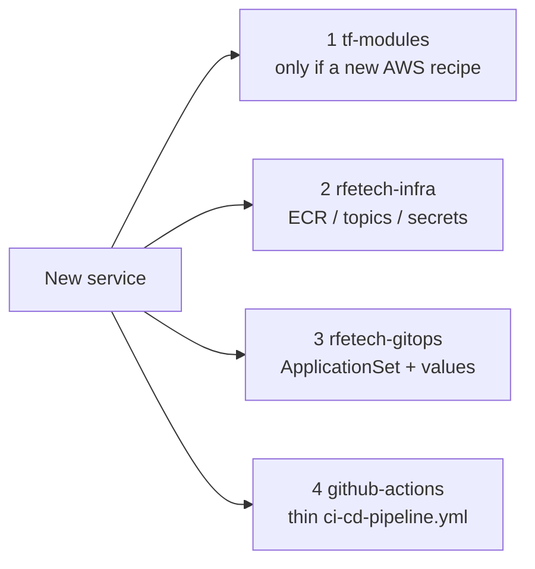
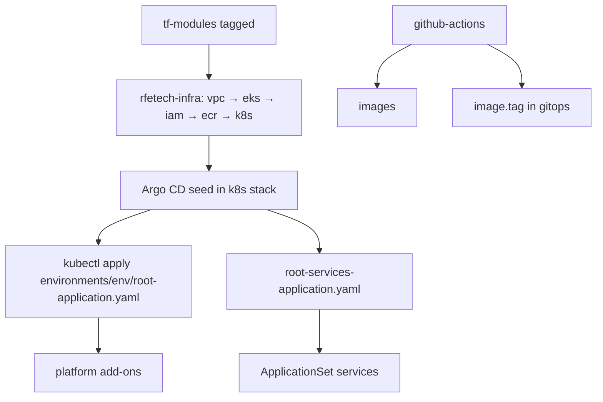

# Creating things in the four repos

This is the cookbook. Each change lives in **one or more** of the four GitHub repos. Do the steps in order. Do not put AWS sizes in GitOps, or Helm replica counts in Terraform.



Related: full catalogues on [tf-modules](/infra/repos/tf-modules), [rfetech-infra](/infra/repos/rfetech-infra), [rfetech-gitops](/infra/repos/rfetech-gitops), [rfetech-github-actions](/infra/repos/rfetech-github-actions).

---

## 1. Create a new microservice (all four repos)

A new API or worker is **not** only a GitHub repo. Cloud will not run it until ECR, GitOps, and CI exist.

### A. Service git repo (application code)

Create the product repo (Python/Go/Next). Keep CI **thin**:

```yaml
# .github/workflows/ci-cd-pipeline.yml
jobs:
  sonar:
    uses: rfetechnology/rfetech-github-actions/.github/workflows/sonar.yml@main
    with:
      language: python   # or go
      service_name: myservice
    secrets:
      PAT_GITHUB: ${{ secrets.PAT_GITHUB }}
      SONAR_TOKEN: ${{ secrets.SONAR_TOKEN }}
  # then quality-gate → extract-version → build-docker-image → push-ecr-image → update-helm-charts
```

Repo-specific tests go in a **sibling** workflow file, not inside the reusable chain. Health endpoints: `/livez`, `/readyz`.

Do **not** invent a new pipeline in the service repo. Change shared behaviour in `rfetech-github-actions`.

### B. `rfetech-infra` — registry (and data if needed)

1. Add an ECR repository name in the env stacks:
   - develop: `rfe-infra/rfe-dev/ecr/terraform.tfvars` → `myservice-develop`
   - perf: `rfe-infra/rfe-perf/ecr/` → `myservice-perf`
   - prod: `rfe-infra/rfe-prod` ECR list → `myservice-prod` (or module suffix)
2. If the service needs a **new Kafka topic**, add it to `rfe-dev/kafka/terraform.tfvars` `topic_names` (`develop_*` and `perf_*`) **and** prod `main.tf` (`prod_*`). Topics are not created by the app at boot.
3. If it needs a **new outbox CDC** stream, add the service name to Debezium `outbox_connectors` (dev/perf stacks + prod) — module `MSK_CONNECT`.
4. If it needs a **new S3 bucket**, add it to the env `s3/` stack.
5. `terraform plan` / apply in that folder only. Apply order still `vpc → eks → …`; ECR can follow VPC.

Config DSNs come from Config Manager (`config_{env}_{region}`). Do not put passwords in Helm values.

### C. `rfetech-gitops` — make Argo CD deploy it

1. Create values for each env that should run it:

```
helm-charts/helm-overrides/fantasy7-develop/myservice/custom-values.yaml
helm-charts/helm-overrides/fantasy7-perf/myservice/custom-values.yaml
helm-charts/helm-overrides/fantasy7-prod/myservice/custom-values.yaml
```

Set `fullnameOverride`, image repository (ECR), probes, resources, `httpRoutes` (gateway host + path), `secretProvider` if it reads Secrets Manager, `serviceAccount.annotations` for Pod Identity.

2. Add the name to **ApplicationSets** (this list is what actually deploys):

- `falcon-apps-of-apps/app-services/develop/application-set-develop.yaml`
- `.../perf/application-set-perf.yaml`
- `.../prod/application-set-prod.yaml`

A values folder with no ApplicationSet entry does **nothing**. Retired services still have leftover folders.

3. Chart is always `helm-charts/helm-templates/1.0.0`. Do not copy a new chart per service unless you have a real reason.

4. Push to `main`. Argo CD syncs namespace `development` / `performance` / `production`.

### D. `rfetech-github-actions` — only if the pipeline cannot do this language/path yet

Usually you **call** existing workflows. Open a PR in the actions repo only to add a new reusable workflow, a new input, or a new service to a release-train matrix (`ship-release.yml`, Big Bash, Patch).

### E. This docs repo

Add the service to the [catalog](/catalog/services) and C4 model if it is a real product container. Update infra narrative if the data plane changed.

**Merge order:** infra (ECR/topics) → gitops (so Argo has a repo to pull) → service CI (so the first image tag can land). Actions repo only if you changed workflows.

---

## 2. Create or change a Terraform module (`tf-modules`)

Use this when **every** environment should get a new AWS behaviour (new resource type, or a knob all stacks need).

1. Branch `tf-modules`. Code under `modules/<NAME>/` (`main.tf`, `variables.tf`, `outputs.tf`).
2. Point `rfetech-infra` at a **local path** while iterating:

```hcl
source = "../../../tf-modules/modules/MYMODULE"
```

3. Then point at the branch:

```hcl
source = "git@github.com:rfetechnology/tf-modules.git//modules/MYMODULE?ref=my-branch"
```

(`//` after `.git` is required.)

4. PR in `tf-modules` with a **version label**. Merge cuts a tag/release.
5. Bump `?ref=` in **rfetech-infra** and PR that. Nothing live changes until infra applies.

`terraform init` needs GitHub SSH (or Actions PAT rewrite). `CODEOWNERS`: infra-team.

---

## 3. Create AWS in an environment (`rfetech-infra`)

Use this when **this env** needs a size, a topic, a bucket, a CloudFront alias — not a new recipe.

| Create… | Develop folder | Perf | Prod |
|---|---|---|---|
| VPC / EKS | `rfe-dev/vpc`, `eks`, `k8s` | **do not** — shared | `rfe-prod/main.tf` then `k8s/` |
| Kafka topic | `rfe-dev/kafka` `topic_names` | same cluster, `perf_*` prefix in **dev kafka stack** | `rfe-prod/main.tf` |
| Aurora / Valkey | `aurora/`, `elasticache/` | Valkey overlay only; Aurora **shared** | monolith `main.tf` |
| Debezium connector | `rfe-dev/debezium` | `rfe-perf/debezium` | `main.tf` |
| ECR / S3 / CloudFront / WAF | matching `rfe-dev/*` | matching `rfe-perf/*` | `main.tf` |
| Config secret | `config_manager/` | `rfe-perf/config_manager` | `main.tf` |

Rules:

- One folder = one state. No workspaces.
- Plan in the **leaf**. If the plan creates a VPC, you are in the wrong directory.
- Develop apply order: `vpc` → `eks` → `iam` → `ecr` → `k8s`, then data stacks.
- Prod: core infra apply, then `k8s/`. Gated by `github-aws-int.yaml` (infra-team approval).
- Ignore `Unwanted/`.

---

## 4. Create a cluster add-on (`rfetech-gitops`)

Use this for Traefik, Kyverno, KEDA, Groundcover, etc. — not for product services.

1. `falcon-apps-of-apps/apps/<chart>/base/` — `kustomization.yaml` with `helmCharts:` + default values.
2. Overlays `overlays/dev` and/or `overlays/prod` (folder name `dev` means **develop**).
3. Argo Application: `falcon-apps-of-apps/applications/<env>/<chart>-<env>.yaml` pointing at the overlay.
4. Push. Root app `falcon-apps-system` (from `environments/<env>/root-application.yaml`) picks it up.

**Perf** usually does **not** get a new copy of Traefik/Groundcover — it shares the develop cluster. Perf `applications/perf` is extra data-plane (PostgreSQL HA), not a second platform stack.

Product services use ApplicationSet (section 1), not a new `apps/` chart.

---

## 5. Create or change CI (`rfetech-github-actions`)

| Create… | Where |
|---|---|
| Shared scan/build/ship behaviour | `.github/workflows/*.yml` (`workflow_call`) |
| One service’s extra test | **that service repo**, separate workflow |
| New env mapping (branch → ECR suffix → `fantasy7-*`) | `update-helm-charts.yml` + service `ENVIRONMENT` input |
| Coordinated release | `release-control-plane.yml` / `patch-release.yml` / `ship-release.yml` |
| Prod Terraform apply | `github-aws-int.yaml` |

There are **no** composite `action.yml` files. Pin `@main`. Image tags: `V{run}-{semver}`, never `latest`. GitOps bump writes `rfetech-gitops`, not `rfetech-infra`.

---

## 6. Create a new *environment* (rare)

Today: local, isolated, **develop**, **perf**, **prod**. Perf is a namespace + overlays on develop’s account/cluster, not a third AWS account.

If you ever add another cloud env you would typically need:

1. `rfetech-infra` — account or overlay folders, state key, ECR suffix, CloudFront hosts, config secret name.
2. `rfetech-gitops` — `environments/<env>/root-*.yaml`, `applications/<env>/`, `app-services/<env>/application-set-*.yaml`, `helm-overrides/fantasy7-<env>/`.
3. `rfetech-github-actions` — branch validation + `ENVIRONMENT` → ECR/GitOps path.
4. This docs repo + C4 deployment view.

That is why perf was built as overlays: cheaper than a full copy of VPC/EKS/MSK.

---

## 7. Bootstrap a cluster from nothing (order)



Terraform does **not** install Groundcover/Kyverno/product Deployments. It seeds Argo. GitOps does the rest.

---

## 8. Laptop stack (not one of the four)

**Local-dev-setup** is how you run the same *services* without AWS. Postgres/Redis/Kafka/LocalStack replace Aurora/Valkey/MSK. See [Local & isolated stack](/infra/local-stack). Creating a local compose service does not create ECR or GitOps; you still follow section 1 before develop.

---

## Checklist: wrong repo

| Symptom | You probably edited |
|---|---|
| Plan wants to create a VPC | Wrong `rfetech-infra` folder |
| Image tag never changes on cluster | CI did not call `update-helm-charts`, or wrong `fantasy7-<env>` |
| Values file exists but no pod | Missing ApplicationSet list entry |
| Every env got a weird Aurora change | You changed `tf-modules` and bumped `ref` everywhere |
| `kubectl apply` in a service repo | Don’t. GitOps owns desired state |
