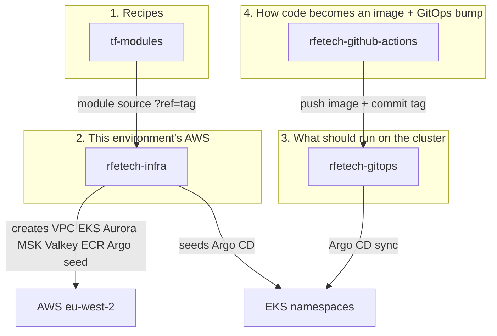

# Repos

Four GitHub repositories own cloud infrastructure. This site **explains** them. The repos **are** the config.

| Repo | GitHub | Owns | Does **not** own |
|---|---|---|---|
| [tf-modules](/infra/repos/tf-modules) | `rfetechnology/tf-modules` | How a VPC / Aurora / MSK / WAF is *built* | Which size prod uses |
| [rfetech-infra](/infra/repos/rfetech-infra) | `rfetechnology/rfetech-infra` | Accounts, VPCs, clusters, databases, Kafka topics, ECR, CloudFront | Pod replica counts, HTTPRoutes |
| [rfetech-gitops](/infra/repos/rfetech-gitops) | `rfetechnology/rfetech-gitops` | Platform add-ons + every service Helm values | Terraform resources |
| [rfetech-github-actions](/infra/repos/rfetech-github-actions) | `rfetechnology/rfetech-github-actions` | Reusable CI: scan, build, push, bump GitOps, release trains | Cluster YAML |

A fifth repo, **Local-dev-setup**, runs the laptop/CI compose stack. It is not AWS. See [Local & isolated stack](/infra/local-stack).

## Mental model

Think in **layers**, not “the infra repo”:

1. **Module** (`tf-modules`) — the recipe. Change this when *every* environment should get a new behaviour (for example “all MSK clusters enable a log destination”).
2. **Stack** (`rfetech-infra`) — one folder, one Terraform state, one environment (or overlay). Change this when *this* env needs a bigger Aurora, a new Kafka topic, or a new ECR repo.
3. **Desired cluster state** (`rfetech-gitops`) — Argo CD watches git. Change this when a service needs more replicas, a new HTTPRoute, a secret mount, or you add a cluster add-on.
4. **Pipeline** (`rfetech-github-actions`) — service repos stay thin. Change this when every Python/Go/frontend pipeline should lint, scan, or ship differently.

If you edit the wrong layer, the change either will not apply, or will apply everywhere you did not intend.

## Everyday “I want to…”

| I want to… | Repo | Where |
|---|---|---|
| Add a Kafka topic | `rfetech-infra` | `rfe-dev/kafka/terraform.tfvars` `topic_names` and prod `main.tf` |
| Change how topics are created | `tf-modules` | `modules/KAFKA` |
| Bump a service image | CI does it | GitOps `helm-overrides/fantasy7-<env>/<service>/custom-values.yaml` `deployment.image.tag` |
| Add HTTP path `/foo` on gateway | `rfetech-gitops` | that service’s `custom-values.yaml` `httpRoutes` |
| Add a new microservice | all four, in order | ECR in infra → ApplicationSet list + values folder in gitops → thin `ci-cd-pipeline.yml` calling actions |
| Install Kyverno / KEDA / Traefik tweak | `rfetech-gitops` | `falcon-apps-of-apps/apps/<addon>/` |
| Change Sonar / Trivy / Docker build | `rfetech-github-actions` | `.github/workflows/` |
| Resize prod Aurora | `rfetech-infra` | `rfe-prod/terraform.tfvars` (not the module, unless the knob does not exist) |
| Explain the design | this docs repo | plus an [ADR](/adr/) if it is a decision |

## Naming that looks like other products

| String in git | Means |
|---|---|
| BigBash | Product / public DNS (`bigbash.site`, `bigbash.life`) |
| FalconX | Service codebase / platform name |
| `fantasy7-*` | Helm override folders in GitOps (historical) |
| `rfe-dev` / `rfe-prod` | Terraform env folders |
| overlay `dev` | Kustomize overlay for **develop** |
| `falcon-apps-of-apps` | Argo CD tree for platform + service ApplicationSets |

## Rules

- **Never paste secrets, DSNs, or full values files into this docs repo.** Field *names* (`DATABASE_HOST`, `KAFKA_SERVER_URL`) are OK; values are not.
- If this page and Terraform disagree, Terraform wins — then update this page.
- Promoting architecture: ADR here → implement in the repo that owns the config → merge in dependency order (modules → infra → gitops / actions).

Read next: pick a repo page in the sidebar, or start with [tf-modules](/infra/repos/tf-modules) if you need to understand AWS construction.
