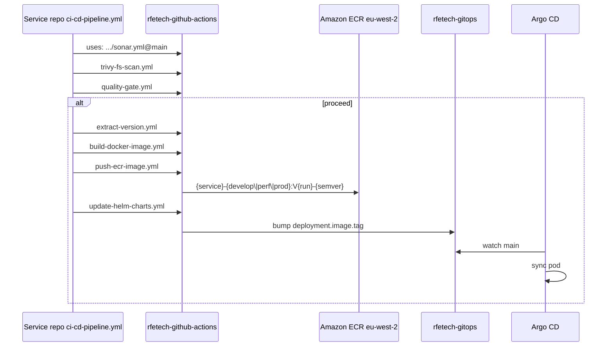

# rfetech-github-actions

**GitHub:** `rfetechnology/rfetech-github-actions`  
**Role:** Central **reusable workflows** (`workflow_call`). Every service repo keeps a **thin** `ci-cd-pipeline.yml` that only *calls* this repo. There are **no composite actions** (`action.yml`) — reuse is workflows only.

`CODEOWNERS`: workflow changes → `@rfetechnology/infra-team`.

The README in this repo is **partly stale** (it still lists `sonar-python-uv.yml` / `sonar-go.yml`). Live unified files are `sonar.yml` and `lint.yml`. This page follows the files under `.github/workflows/`.



---

## How a service repo should look

1. **Qualify** on every PR/push: Sonar + Trivy (+ lint).
2. **Gate** with `quality-gate.yml` so one reusable-workflow startup failure does not hide other checks.
3. **Build** only if `proceed == true`.
4. **Deploy** = push ECR + GitOps tag bump.

Repo-specific tests belong in **separate** workflow files, not inside the reusable job graph.

Call pin: `rfetechnology/rfetech-github-actions/.github/workflows/<file>@main`.

Python uses **UV**. Go has a `go_version` input. Frontends are Next/React; some still have Amplify (`deploy-fe.yml`) but **B2B/B2C in cluster** ship like any other Helm service.

---

## Workflow catalogue

### Gates

| File | When | Function |
|---|---|---|
| `validate-branch.yml` | Manual `workflow_dispatch` | Branch must match target env |
| `check-infra-team.yml` | Manual deploy | Actor must be in GitHub team `infra-team` (`PAT_GITHUB`) |
| `quality-gate.yml` | After qualify | Combines Sonar/Trivy/validation results → `proceed` |
| `pr-policy-gate.yml` | Prod-bug PRs | Template / E2E evidence fields |

### Quality

| File | Function |
|---|---|
| `sonar.yml` | Unified SonarQube for **Go or Python (UV)** — `language` input |
| `lint.yml` | Autofix + lint for `python` / `go` / `node` |
| `trivy-fs-scan.yml` | Filesystem vuln/secret/misconfig; optional Google Chat webhook |

### Build & ship (Kubernetes)

| File | Function |
|---|---|
| `extract-version.yml` | Semver from branch/tag + image tag **`V{run}-{semver}`** (uppercase `V`, never `latest`) |
| `build-docker-image.yml` | Buildx, registry cache (`buildx-cache` ECR), Trivy **image** scan, upload `image.tar` |
| `push-ecr-image.yml` | Load artifact, push immutable tag |
| `update-helm-charts.yml` | Commit tag into `rfetech-gitops` `helm-overrides/fantasy7-<env>/<chart>/custom-values.yaml` (rebase retry up to 5×). Author: “Deployment Bot”. |
| `build-ecr-image.yml` | **Legacy** combined build+push+GitOps for older `develop`/`uat` paths |
| `ship-service.yml` | One-job ship: build+scan+push+GitOps (pilot `ship.yml` / `ship-release.yml`) |
| `rollback.yml` | Git-revert a GitOps commit |

### Lambdas & frontends (not GitOps)

| File | Function |
|---|---|
| `build-lambda.yml` | SAM build+deploy Python or Go. Artefacts on S3 (`falconx-{bucket}-{env}` / prod `falcon-*`). |
| `build-go-lambda.yml` | Deprecated shim → `build-lambda.yml` with `LANGUAGE: go` |
| `destroy-lambda.yml` | `sam delete` |
| `deploy-fe.yml` | Amplify webhook (`AWS_AMPLIFY_TOKEN`) — not the primary B2C/B2B path (those are EKS) |

### Terraform / secrets / ops

| File | Function |
|---|---|
| `terraform.yml` | Reusable plan; **apply only on `workflow_dispatch`**. Caller path `./environments/{REGION}_{ENVIRONMENT}`. |
| `github-aws-int.yaml` | Prod **rfetech-infra** core then `k8s/`: plan → `trstringer/manual-approval` (infra-team) → apply. Assumes `IAC_Role` in `389068786427`. |
| `update-secrets-manager.yml` | Add/update Secrets Manager keys by env |
| `alerts-deploy.yml` | Google Apps Script alerts (GCP WIF) |
| `gha-k8s-hosted-demo.yml` | ARC runner + DinD smoke |

### Release trains (orchestrators)

| File | Nickname | Function |
|---|---|---|
| `ship-release.yml` | — | Infra-team: freeze / promote / patch / rollback a version |
| `release-control-plane.yml` | **The Big Bash** | Coordinated multi-service release + change request |
| `patch-release.yml` | **The Patch** | Hotfix with per-service checkboxes |
| `promote-main-to-prod.yml` | — | Fan-out PRs `main → prod` across ~23 service repos |
| `sync-main-to-performance.yml` | — | Reset `performance` branch trees to `main` (not PR-based) |
| `backsync.yml` | — | After prod hotfix, PR `prod → main`; validates prod CI |

`ground-cover-push-traces.yaml` (if present / similarly named) exports OTEL traces from Big Bash / Patch into Groundcover.

---

## Branch → environment → ECR → GitOps

| Environment | Typical branch | ECR repository | GitOps folder |
|---|---|---|---|
| develop | `main` | `{service}-develop` | `fantasy7-develop/` |
| perf | `performance` (manual deploy allows other branches) | `{service}-perf` | `fantasy7-perf/` |
| prod | `release/vX.Y.Z` or `release/*` | `{service}-prod` | `fantasy7-prod/` |

ECR is **`eu-west-2`**. Develop account `460195068944`; prod account `389068786427`. Prod builds switch secrets:

```yaml
AWS_ACCESS_KEY_ID: ${{ startsWith(github.ref, 'refs/heads/release/') && secrets.AWS_ACCESS_KEY_ID_PROD || secrets.AWS_ACCESS_KEY_ID }}
```

`ship-service.yml` uses `_PROD` credentials when `env=prod`.

Image tag rules: uppercase `V{number}` or `V{number}-{semver}`. Ship-path variants exist (`v{run}-dev`, `v{run}-prod-{X.Y.Z}`). Build cache: ECR `buildx-cache`.

Rollback happy path: **revert the GitOps commit**, not `kubectl rollout undo`. Cluster state is git.

---

## Auth (mechanism only)

| Mechanism | Used for |
|---|---|
| Static AWS keys `AWS_ACCESS_KEY_ID` (+ `_PROD`) | Most ECR / SAM / Secrets Manager |
| `PAT_GITHUB` | Private sibling clones, push to gitops, team membership, PR automation, lint autofix (must re-trigger CI) |
| Assume `IAC_Role` + external ID | Prod Terraform `github-aws-int.yaml` |
| GCP Workload Identity Federation | `alerts-deploy.yml` |
| `SONAR_TOKEN` | SonarQube |
| Chat webhooks | Trivy / ship notifications |

**GitHub OIDC → AWS is not** the default for service CI. ECR access is key-based today. `id-token: write` appears on a few workflows but most AWS calls still use keys.

Do not document secret **values** here.

---

## Typical `uses:` chain

```yaml
jobs:
  validate-branch:
    if: github.event_name == 'workflow_dispatch'
    uses: rfetechnology/rfetech-github-actions/.github/workflows/validate-branch.yml@main
    with:
      environment: ${{ inputs.environment }}
      current_branch: ${{ github.ref_name }}

  sonar:
    uses: rfetechnology/rfetech-github-actions/.github/workflows/sonar.yml@main
    with:
      language: python   # or go
      service_name: MyService
    secrets:
      PAT_GITHUB: ${{ secrets.PAT_GITHUB }}
      SONAR_TOKEN: ${{ secrets.SONAR_TOKEN }}

  quality-gate:
    needs: [sonar, trivy-fs]
    uses: rfetechnology/rfetech-github-actions/.github/workflows/quality-gate.yml@main
    with:
      event_name: ${{ github.event_name }}
      sonar_result: ${{ needs.sonar.result }}
      trivy_result: ${{ needs.trivy-fs.result }}

  build:
    needs: [quality-gate, extract-version]
    if: needs.quality-gate.outputs.proceed == 'true'
    uses: rfetechnology/rfetech-github-actions/.github/workflows/build-docker-image.yml@main
    with:
      ECR_REPOSITORY: myservice
      IMAGE_TAG: ${{ needs.extract-version.outputs.image_tag }}
      ENVIRONMENT: develop

  update-helm:
    needs: [push]
    uses: rfetechnology/rfetech-github-actions/.github/workflows/update-helm-charts.yml@main
    with:
      CHART: myservice
      IMAGE_TAG: ${{ needs.extract-version.outputs.image_tag }}
      ENVIRONMENT: develop
    secrets:
      PAT_GITHUB: ${{ secrets.PAT_GITHUB }}
```

`update-helm-charts.yml` writes GitOps, **not** `rfetech-infra` (README is wrong on that line).

---

## Observability tie-in

Release orchestration can emit traces to Groundcover. Metrics inventory: `docs/RFE-Metrics-Inventory.md` in this same repo. In-cluster telemetry is GitOps — see [Observability](/infra/observability) and [rfetech-gitops](/infra/repos/rfetech-gitops).

---

## What belongs where

| Change | Repo |
|---|---|
| How every service is scanned/built/shipped | **this repo** |
| One service’s extra unit-test job | **that service repo** (sibling workflow) |
| Replica count / HTTPRoute / secret mount | `rfetech-gitops` |
| New ECR repository | `rfetech-infra` |

Back to [Repos](/infra/repos/).
