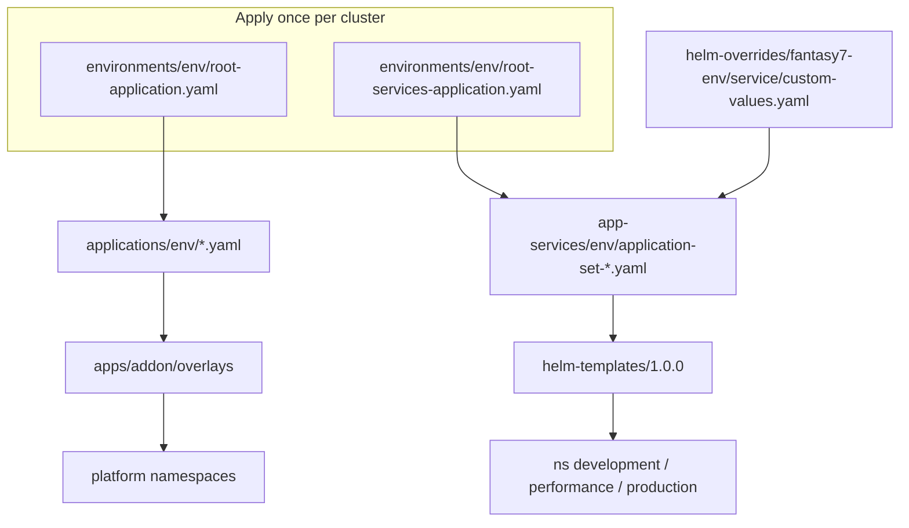

# rfetech-gitops

**GitHub:** `rfetechnology/rfetech-gitops`  
**Role:** **Desired state** for Kubernetes. Argo CD makes the cluster match `main`. CI never `kubectl apply`s product apps — it only commits image tags here.

Two trees:

| Tree | Path | Job |
|---|---|---|
| Platform (App-of-Apps) | `falcon-apps-of-apps/` | Traefik, Groundcover, KEDA, Kyverno, secrets CSI, … |
| Product services | `helm-charts/` | One generic Helm chart + per-service `custom-values.yaml` |

Bootstrap roots: `destination.server = https://kubernetes.default.svc` (in-cluster), `automated.prune + selfHeal`, `CreateNamespace=true`.

The falcon README still mentions `root-application.yaml` at the folder root — that path moved to **`environments/<env>/`**.

---

## Environments vs folders

| Logical env | Helm overrides | Argo `applications/` | Workload namespace | Kustomize overlay |
|---|---|---|---|---|
| develop | `fantasy7-develop/` | `applications/develop/` | `development` | `overlays/dev` |
| perf | `fantasy7-perf/` | `applications/perf/` | `performance` | `overlays/perf` (where present) |
| prod | `fantasy7-prod/` | `applications/prod/` | `production` | `overlays/prod` |

`fantasy7-*` is historical. It means BigBash.

**Perf does not reinstall Traefik or Groundcover.** Those run on the shared develop cluster. `applications/perf` is extra data-plane for load tests (CloudNativePG / PostgreSQL HA).

---

## Platform add-ons (`falcon-apps-of-apps/apps/`)

Pattern: `apps/<chart>/base` (Helm via Kustomize `helmCharts:`) + `overlays/<env>`. One Argo `Application` per chart per env in `applications/<env>/`. Naming: `<chart>-<env>.yaml`.

### Develop (`applications/develop/` — 29 manifests)

| Category | Apps |
|---|---|
| Ingress / DNS / certs | `traefik`, `traefik-cloudfront`, `external-dns`, `gateway-api-crds`, `certificates` |
| Policy / secrets | `kyverno`, `kyverno-policies`, `oauth2-proxy`, `secrets-store`, `secrets-store-provider` |
| Observability | `groundcover`, `kube-prometheus-stack`, `opentelemetry-operator`, `otel-collector` |
| Scale / metrics | `keda`, `metrics-server` |
| Scheduling | `priority-classes` |
| Dev-only tools | `kubecost`, `chaos-mesh`, `k6-operator` + several k6 TestRun Applications |
| CI runners | `actions-runner-controller`, `gha-runner-scale-set` |

### Prod (`applications/prod/` — 18 manifests)

Traefik + CloudFront Traefik, ExternalDNS, Gateway CRDs, certificates, Groundcover, kube-prometheus-stack, KEDA, Kyverno + policies, oauth2-proxy, OTEL operator + collector, metrics-server, secrets-store + provider, priority-classes, **cluster-overprovisioning**.

Not wired in prod `applications/` even if charts exist: Chaos Mesh, Kubecost, k6, ClickHouse (chart folders exist; not on the standard app-of-apps path).

### Perf (`applications/perf/`)

`cloudnative-pg-operator`, `postgresql-ha`, `postgresql-da-ha`.

### What each important add-on does

| Add-on | Function |
|---|---|
| **Traefik** (`traefik-external`) | Public-class ingress in `traefik-system`. Gateway API + Ingress + CRD providers. HPA ~3–6. Often on Graviton tainted nodes. |
| **Traefik CloudFront** | **Internal** NLB in `traefik-cloudfront`. CloudFront VPC origin. Gateway `internal-cloudfront-gateway`. |
| **gateway-api-crds** | Gateway CRDs + `public-infra-gateway` (HTTPS for `bigbash.life` / `*.bigbash.life`) and the CloudFront gateway. |
| **external-dns** | HTTPRoute hostnames → Route53. |
| **certificates / cert-manager** | DNS-01 via Route53 (identity also seeded by Terraform). |
| **secrets-store + AWS provider** | CSI driver; rotation; Pod Identity. Apps opt in via Helm `secretProvider`. |
| **Kyverno + policies** | Guardrails: non-root, no `:latest`, resource limits, protect Traefik LB, block some PVC deletes, etc. |
| **KEDA** | ScaledObjects for SQS / MSK / Groundcover Prometheus. Sync-wave `-5`. Prod **services** still use HPA today; KEDA is installed. |
| **metrics-server** | CPU/memory for HPA. |
| **Groundcover** | eBPF sensor + OTLP ingest. BYOC (`global.backend.enabled: false`). UI cluster names Development / Production. ~5% OTEL sampling. Logs from **sensor**, not app-OTLP (`nop`). |
| **OTEL operator + collector** | App OTLP → Groundcover sensor. |
| **kube-prometheus-stack** | Prometheus, Alertmanager, Grafana, node-exporter, kube-state-metrics. Grafana behind oauth2-proxy: `grafana.bigbash.life` / `grafana.bigbash.site`. |
| **oauth2-proxy** | GitHub ForwardAuth for Grafana, Kubecost, Chaos dashboard. |
| **cluster-overprovisioning** | Prod spare capacity so scale-up is faster. |
| **k6 / chaos / kubecost** | Load, failure injection, cost — develop. |

There is **no service mesh** (no Istio/Linkerd). East-west is ClusterIP.

### Adding a platform chart

1. `apps/<chart>/base/kustomization.yaml` with `helmCharts:` + default `values.yaml`.
2. Overlays `dev` / `prod`.
3. `applications/<env>/<chart>-<env>.yaml`.
4. Push — root app syncs.

---

## Product services (ApplicationSet)

Files:

- `falcon-apps-of-apps/app-services/develop/application-set-develop.yaml` → apps named `{{name}}-develop` in ns `development`
- `.../perf/application-set-perf.yaml` → `{{name}}-perf` in `performance`
- `.../prod/application-set-prod.yaml` → `{{name}}-prod` in `production`

Each list element deploys:

- Chart path: `helm-charts/helm-templates/1.0.0`
- Values: `helm-charts/helm-overrides/fantasy7-<env>/{{name}}/custom-values.yaml`

`preserveResourcesOnDeletion: true` on develop/prod ApplicationSets — deleting the ApplicationSet must **not** cascade-delete every Deployment (this happened in prod historically).

### Live prod list (authoritative)

`userservice`, `bettingengine`, `betfairstreaming`, `bookmakerdata`, `fancydata`, `casinomanagement`, `livescore`, `livetv`, `manualdatamanagement`, `frontmarket`, `backoffice`, `bets`, `frontend-b2b`, `frontend-b2c`, `dataaggregator`, `markets`

Commented / retired: `betfairworker` (cronjobs moved into bettingengine / betfairstreaming), `betfairdata`, `accountmanagement` (traffic aliased to bettingengine `/api`). Helm folders for retired services may still exist — **ApplicationSet is truth**.

Develop extra: `debug`, `marketsproxy`, `gouser` (emulators commented). Frontend replicas in develop ApplicationSet are `2`; most others `1`.

### ApplicationSet pins

| Env | Forced Helm parameters |
|---|---|
| develop | `autoscaling.enabled=false`, `keda.enabled=false`, `pdb.enabled=false` |
| perf | `autoscaling.enabled=false` (deterministic k6) |
| prod | HPA from values (CPU/memory). Example bettingengine min 8 / max 45 @ 70%. |

### Generic chart (`helm-templates/1.0.0`)

| Template | Renders |
|---|---|
| `deployment.yaml` / `deployment-go.yaml` / `deployment-worker.yaml` / `deployments.yaml` | Main, Go, worker, extra deployments |
| `service.yaml` | ClusterIP |
| `httproute.yaml` | **Primary edge** (Gateway API) |
| `ingress.yaml` | Legacy Ingress |
| `secretprovider.yaml` | AWS Secrets Manager CSI |
| `hpa.yaml` | When autoscaling on and KEDA off |
| `scaledobject.yaml` | When `keda.enabled` |
| `cronjob.yaml` | Scheduled jobs |
| `pdb.yaml` / `pdb-worker.yaml` | Disruption budgets |
| `pre-sync-job.yaml` / `post-sync-job.yaml` | Argo hooks (migrations) |
| `serviceaccount.yaml` | Pod Identity / IRSA annotations |
| `leader-election-rbac.yaml` | Leader election |

Health convention: **`/livez`** and **`/readyz`**.

Typical `custom-values.yaml` keys: `fullnameOverride`, `deployment` (image, probes, resources), `service`, `autoscaling`, `httpRoutes`, `secretProvider`, `serviceAccount.annotations`, `cronjobs`, `worker`, `go`, `preSyncJob`.

Image tags look like `V3357-6.7.0` (run number + semver). CI writes `deployment.image.tag`. Never `latest`.

### Adding a new service

1. ECR repo in `rfetech-infra`.
2. Folder `helm-overrides/fantasy7-{develop,perf,prod}/<name>/custom-values.yaml`.
3. Add `- name: <name>` to all three ApplicationSets (or the envs that should run it).
4. Thin `ci-cd-pipeline.yml` in the service repo calling `rfetech-github-actions`.
5. HTTPRoute host/path, `secretProvider`, resources, probes.

---

## Promotion develop → prod (inside this repo)

Not the same as promoting **git branches** in service repos. This path copies **Helm values** from `fantasy7-develop` → `fantasy7-prod` with a rules engine:

| Path | Role |
|---|---|
| `.github/workflows/promote-to-prod.yml` | Dry-run + PR |
| `.github/scripts/promote_to_prod.py` | Engine |
| `.github/scripts/promotion-config.yaml` | What is auto / flagged / never |
| `.github/.promotion-baseline` | SHA of last successful promotion |

**Never promoted** (must stay env-specific): `fullnameOverride`, image repository/tag, resources, replica counts, **all DB/Redis pool env vars**, autoscaling min/max. Pools are computed from `.github/connection-budget/<env>.yaml` — promoting develop’s `DB_POOL_*` into prod would smash prod’s budget.

Prod PRs: `check-production-access.yml` requires `infra-team`.

Helm PRs: `helm-validate-pr.yml` lints/templates and gates connection-budget drift.

---

## Other GitOps workflows

| Workflow | Function |
|---|---|
| `scale-data-plane.yml` | Heat-event scale of Aurora / MSK / ElastiCache / MSK Connect (IAM from `rfetech-infra`) |
| `sync-connection-budget.yml` | Recompute pool env vars from budget YAML + AWS |
| `perf-creation-workflow.yml` / `perf-destroy-workflow.yml` | Bootstrap / tear down perf ApplicationSets |
| `k6-pvc-sync.yml` | k6 script PVC |
| `build-postgresql-ha-image.yml` | Custom PG image for perf HA |

## Secrets rules

- `secretProvider` in values → `SecretProviderClass` → CSI mount → optional synced K8s Secret.
- PreSync migration Jobs wait until the class exists (sync-wave).
- **No credentials in `custom-values.yaml`.** Config blob comes from Terraform Config Manager (`config_{env}_{region}`).

## Source-of-truth order (from gitops architecture docs)

1. ApplicationSet + `fantasy7-prod/*/custom-values.yaml`
2. `rfetech-infra` `rfe-prod`
3. Confluence runbooks (secondary)

Next: [rfetech-github-actions](/infra/repos/rfetech-github-actions) — how image tags get into those values files.
