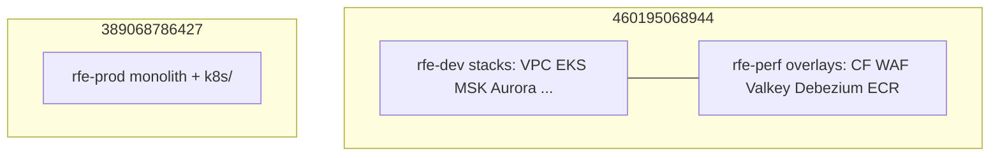

# rfetech-infra

**GitHub:** `rfetechnology/rfetech-infra`  
**Role:** Live AWS for develop, perf, and prod. Calls [tf-modules](/infra/repos/tf-modules). **Does not** deploy application pods (that is GitOps after Argo is seeded).

```
rfetech-infra/rfe-infra/
├── rfe-dev/          # many small stacks (one folder = one state file)
├── rfe-perf/         # overlays only — no VPC, no EKS, no MSK cluster
├── rfe-prod/         # one core stack + k8s/
├── groundcover/      # IAM role for Groundcover control plane (not the sensor)
└── db-migrations/    # helper scripts
```

Ignore `Unwanted/` (old Singapore / London landing zones). **No Terraform workspaces.** Each folder has its own S3 backend key.

Region for almost everything: **`eu-west-2`**. WAF and CloudFront ACM: **`us-east-1`** (provider alias `virginia`).

## Accounts and clusters

| | Develop | Perf | Prod |
|---|---|---|---|
| AWS account | `460195068944` | **same as develop** | `389068786427` |
| VPC | `rfe-dev-vpc` `10.10.0.0/16` | shared | `rfe-prod-vpc` `10.30.0.0/16` |
| EKS | `rfe-dev-cluster` v1.35 Auto Mode | shared | `rfe-prod-cluster` v1.35 Auto Mode |
| State bucket | `rfe-terraform-state` | same | `rfe-infra-terraform-state` |
| Domain | `*.bigbash.life` | `*.bigbash.life` | `bigbash.site` |

**Perf is not a third account.** It is namespace `performance` on `rfe-dev-cluster` plus overlay stacks (CloudFront, WAF, Valkey, Debezium, ECR, S3, EventBridge, config). Kafka topics for perf are created on **shared** MSK `rfe-kafka` with prefix `perf_*`. Aurora is also shared with develop.



## State keys (examples)

```
rfe-terraform-state
  rfe-infra/rfe-dev/vpc/vpc.tfstate
  rfe-infra/rfe-dev/eks/eks.tfstate
  rfe-infra/rfe-dev/kafka/kafka.tfstate
  rfe-infra/rfe-dev/k8s/k8s.tfstate
  rfe-infra/rfe-perf/elasticache/elasticache-perf.tfstate

rfe-infra-terraform-state
  rfe-prod/eu-west-2/core-infra.tfstate
  rfe-prod/eu-west-2/kubernetes.tfstate

falcon-terraform-state-groundcover
  rfe-infra/groundcover/groundcover.tfstate
```

Remote-state edges: `vpc` → `eks` → `iam` / `k8s`; `kafka` → `debezium` / `config_manager`; `waf` → `cloudfront`. Plan in the **leaf** folder. If a plan wants to create a VPC, you are in the wrong directory.

---

## Develop stacks (`rfe-infra/rfe-dev/`)

Apply order from the README: **`vpc` → `eks` → `iam` → `ecr` → `k8s`**. Data stacks follow once VPC/SGs exist.

| Folder | What it provisions | Notes |
|---|---|---|
| `vpc/` | `rfe-dev-vpc`, NAT, flow logs (90d), Karpenter/ELB subnet tags | CIDR `10.10.0.0/16`. Optional CNI `/28` reservations in `cidr_reservations.tf`. |
| `security-groups/` | RDS SG (5432 from VPC), MSK SG (9092/9094/9096/9098) | Shared by Aurora, Kafka, Debezium. |
| `eks/` | Cluster `rfe-dev-cluster` | Auto Mode via `tf-modules/EKS`. |
| `iam/` | `{cluster}-admin-role`, `-developer-role`, `-poweruser-role`, EKS Access Entries, service user, IRSA/Pod Identity, **GitHubActionsEKSRole** (heat-event scale) | Groups: administrator, developers, power-user. |
| `k8s/` | Argo CD, Karpenter NodePools, cert-manager, KEDA + external-dns identities, storage class | **Seed** only. Groundcover/Kyverno/etc. come from GitOps after Argo exists. Helm value snippets in `helm-values/`. |
| `ecr/` | `{service}-develop` repos, mutable `e2e-tests-*` | Immutable app tags; e2e repos must be mutable (per-PR retags). |
| `kafka/` | MSK `rfe-kafka`, 3× `kafka.m7g.large`, 3.9.x KRaft, SCRAM+IAM | Creates **both** `develop_*` and `perf_*` topics. `auto.create.topics.enable=false`. |
| `debezium/` | MSK Connect outbox connectors for develop | Services: userservice, bettingengine, casinomanagement. Plugin bucket `falconx-dev-msk-connect-plugins`. |
| `aurora/` | `aurora-dev` Postgres 17.9 Serverless v2 (1–4 ACU), Multi-AZ, logical replication | Main OLTP. |
| `aurora-da/` | `aurora-da-dev` | Data Aggregator cluster. |
| `rds/` | Legacy `rds-develop` | Older module; prefer Aurora. |
| `elasticache/` | `dev-elasticache` Valkey 9, cluster mode, `cache.m7g.large`, 1 shard + 2 replicas, Multi-AZ | App cache. |
| `elasticache-global/` | `rfe-dev-master-london` Valkey 8 `t4g.small` | Leftover global RG; prefer cluster-mode Valkey 9. |
| `config_manager/` | Aggregates secrets → `config_develop_eu-west-2` | Reads Aurora/Kafka/Redis. |
| `cloudfront/` | `b2c-develop.bigbash.life` + alts `b2b-develop`, `gateway-develop` | VPC origin → internal Traefik NLB; S3 `rfe-develop-static-assets`. Script `deploy-static-assets.sh`. |
| `waf/` | `rfe-dev-cloudfront-waf` | `rule_mode=COUNT`. |
| `s3/` | fancydata, bettingengine, partitions, MFA QR, MSK plugins, test reports | Names `falconx-*-develop`. |
| `bastion-ssm/` | SSM bastion + `port-forward.sh` | RDS 5432, Redis 6379, Kafka TLS ports. No SSH. |
| `cloudwatch/` | IAM for Prometheus CloudWatch exporter | SA in `monitoring`. |
| `scale-lab/` | **Destroyed** (2026-07-21) | Scaling is GitHub Actions + GitOps IAM. |

### Kafka topics (develop stack)

Event families (each has `develop_*` and `perf_*` on the **same** cluster): `bet_placed`, `bet_cancelled`, `market_settlement`, `market_rollback`, `settled_market_recalibrate`, `live_market_recalibrate`, `user_sync`, plus `failed_*` and `dlq_*` twins. Perf also has `accounts_audit`. **New event type = Terraform change here (and prod), not an app boot-time create.**

### ECR repositories (develop)

Examples: `user-service-develop`, `bettingengine-develop`, `bettingengine-lambdas-develop`, `frontend-b2c-develop`, `frontend-b2b-develop`, `markets-develop`, `bets-develop`, `marketsproxy-develop`, `gouser-develop`, `emulators-develop`, plus remaining product services. Mutable: `e2e-tests-develop` / `-perf` / `-prod`.

---

## Perf overlays (`rfe-infra/rfe-perf/`)

| Folder | Why it exists (cannot share develop’s) |
|---|---|
| `cloudfront/` | Hosts `b2c-perf` / `b2b-perf` / `gateway-perf` on `bigbash.life` |
| `waf/` | `rfe-perf-cloudfront-waf`, **BLOCK** mode |
| `elasticache/` | `perf-elasticache` Valkey 9 `t4g.small`, **no Multi-AZ** (cost) |
| `debezium/` | Perf outbox connectors, plugin bucket `falconx-msk-connect-plugins-perf` |
| `ecr/` | `{service}-perf` |
| `s3/` | `falconx-*-perf` |
| `config_manager/` | `config_perf_eu-west-2` |
| `event_bridge_bus/` | Perf bus |

No VPC, EKS, or MSK cluster folders.

---

## Prod (`rfe-infra/rfe-prod/`)

Two applies:

1. **Core** (`main.tf`, `bastion.tf`, `github-actions-scale-role.tf`) — VPC, SGs, EKS, Aurora ×2, MSK, MSK Connect, ElastiCache, ECR, S3, IAM, WAF, CloudFront, Config Manager, EventBridge, SSM bastion, GitHub OIDC, `GitHubActionsScaleDataPlaneRole`.
2. **`k8s/`** — node pool YAML, storage class, Traefik/ingress Helm, Argo CD, cert-manager, Route53 for `www` / `admin` / `gateway-prod`.

Prod apply is gated: `rfetech-github-actions` workflow `github-aws-int.yaml` (plan → infra-team manual approval → apply). Laptop apply assumes `IAC_Role` in `389068786427`.

| Setting | Prod |
|---|---|
| Aurora | `aurora-prod` writer+reader (`db.r6g.xlarge`) + **RDS Proxy**; `aurora-da-prod` |
| MSK | `kafka-cluster-prod`, topics `prod_*` |
| Valkey | `prod-elasticache-valkey-cluster` m7g.large, cluster mode, Multi-AZ |
| CloudFront | `bigbash.site`, alts `admin`, `www`, `gateway-prod` |
| WAF | `rfe-prod-cloudfront-waf` (COUNT in current tfvars) |
| Config | `config_prod_eu-west-2` |
| Service user | `service-user-rfe-prod` |

Static assets: `./deploy-static-assets.sh b2c` (and b2b) after infra exists.

---

## Groundcover IAM (`rfe-infra/groundcover/`)

Not a cluster and not the eBPF sensor. Creates IAM role `groundcover-managed` that the vendor control plane (`991078109329`) assumes (External ID). In-cluster sensors are GitOps `apps/groundcover`. Share role ARN + region with the vendor when onboarding.

## What Terraform does *not* deploy

| Concern | Lives in |
|---|---|
| Deployments, HTTPRoutes, HPAs, image tags | `rfetech-gitops` |
| Groundcover DaemonSet, Kyverno, KEDA operator, oauth2-proxy | GitOps `falcon-apps-of-apps` |
| Settlement Lambdas | SAM via `rfetech-github-actions` `build-lambda.yml` |
| Connection pool numbers in Helm | GitOps `.github/connection-budget/` |

Terraform Kubernetes layer = **seed** (cluster + Argo + identities + ingress controller). Argo then owns the rest.

## Day-to-day operations

**Kubeconfig (develop):**

```bash
aws eks update-kubeconfig \
  --name rfe-dev-cluster \
  --region eu-west-2 \
  --role-arn arn:aws:iam::460195068944:role/rfe-dev-cluster-admin-role \
  --alias rfe-dev-developer
```

**DB/Redis/Kafka access:** SSM bastion port-forward (`rfe-dev/bastion-ssm/port-forward.sh`, prod `port-forward.sh`). Do not open those ports to the internet.

**Heat events:** GitOps workflow `scale-data-plane.yml` uses IAM roles created here to scale Aurora / MSK / ElastiCache / MSK Connect. Config: `rfetech-gitops/.github/scale-data-plane/`.

Next: [rfetech-gitops](/infra/repos/rfetech-gitops) — what actually runs on those clusters.
