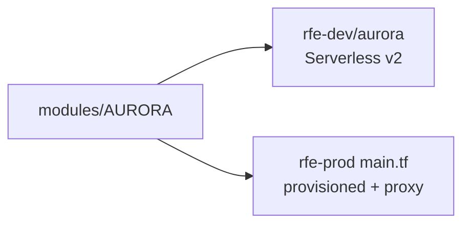
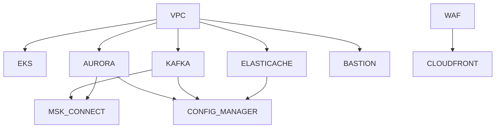

# tf-modules

**GitHub:** `rfetechnology/tf-modules`  
**Role:** Shared Terraform **library**. Recipes only — **no live AWS state**.

`rfetech-infra` calls these modules with environment-specific variables. If you change a module and tag it, every stack that bumps `ref=` gets the new behaviour.

```hcl
source = "git@github.com:rfetechnology/tf-modules.git//modules/<MODULE-NAME>?ref=<tag>"
```

The `//` after `.git` is required: it separates the repo from the module subdirectory. Pin a **tag** in production stacks, not `main`.

`terraform init` clones modules over **SSH**. GitHub Actions rewrites SSH → HTTPS with `PAT_GITHUB` when runners have no deploy key.

## Why this repo exists

Without it, `rfe-dev` and `rfe-prod` would copy-paste VPC / Aurora / MSK code and drift. One module, many instances:



Same recipe, different tfvars.

## How to change a module

1. Branch in `tf-modules`. Optionally point `rfetech-infra` at a **relative path** (`source = "../../../tf-modules/modules/AURORA"`) to iterate.
2. Point infra at `?ref=<your-branch>` and `terraform plan`.
3. Open a PR. PRs require a **version label**; merge cuts a git tag + GitHub release.
4. Bump `ref=` in `rfetech-infra` and open that PR.

`CODEOWNERS`: `/modules/` → `@rfetechnology/infra-team`.

## What is *not* here

No ECS, DynamoDB, or NLB-creator module. Workloads run on **EKS**. The Traefik Network Load Balancer is created by Kubernetes and passed into CloudFront as a VPC origin (`origin_nlb_arn`). Remote state backends live in **rfetech-infra**, not here.

---

## Module catalogue

Paths: `tf-modules/modules/<NAME>/`. Most modules have no README (exception: `WAF`). Inputs live in `variables.tf`.

### Networking

| Module | Creates | How we use it |
|---|---|---|
| **VPC** | VPC, 3 AZ public/private subnets, NAT Gateway, optional flow logs | `rfe-dev/vpc`, prod `main.tf`. Private subnets tagged for Karpenter + internal ELB; public for external ELB. |
| **SECURITY_GROUP** | Named SG `{project}-{environment}-{role}-sg` | RDS, Kafka, ElastiCache ingress from VPC CIDR. |
| **CLOUDFRONT** | Distribution, ACM cert in us-east-1, cache/origin policies, optional S3 origin + OAC, Route53 aliases | Dual origin: internal NLB (VPC origin) + S3 static assets. Wraps `terraform-aws-modules/cloudfront/aws`. |
| **WAF** | CloudFront-scope WAFv2 Web ACL + log group | 7-tier rate limits, JA3 fingerprinting, maintenance kill-switch, COUNT vs BLOCK. **Must** be applied with provider alias `us-east-1`. See below. |
| **WAF_WEB_ACL** | Lower-level generic Web ACL | Custom rule lists; rarely used vs opinionated `WAF`. |
| **ROUTE_53** | Alias A records to existing ALBs | Older ALB DNS path; CloudFront aliases are mostly inside `CLOUDFRONT`. |
| **ALB** | ALB + target group + listeners, attaches to EKS ASGs | Discovers VPC/subnets/ASGs by tags. Health `/healthz`. Not the current public edge (CloudFront → Traefik NLB is). |
| **NAT_INSTANCE** | EC2 NAT instead of NAT Gateway | Alternative; live landing zones use NAT **Gateway** in `VPC`. |
| **VPC_PEERING** | Cross-region peering | Two aliased providers. |
| **VPC_PEERING_MULTI_ACCOUNT** | Cross-account peering + routes both sides | Dual-account providers. |

#### WAF behaviour (important)

Public HTTPS hits this ACL **before** CloudFront cache. Tiers (priorities 0–7) then AWS managed rules (10–80):

| Priority | Rule | Typical key |
|---|---|---|
| 0 | Maintenance kill-switch | All traffic → 503 HTML |
| 1–3 | Authenticated gateway / B2C / B2B | `Authorization` or session cookie |
| 4 | `/login` | IP only |
| 5–6 | Anonymous gateway / frontend | JA3 + IP |
| 7 | Global ceiling | IP |
| 10–80 | Common / bad inputs / SQLi / Linux / optional bot + anti-DDoS | managed |

`rule_mode` is `COUNT` or `BLOCK`. Develop and prod have been run in COUNT (observe); perf in BLOCK. Domain map is built into the module: `*.bigbash.life` vs `bigbash.site`.

### Compute

| Module | Creates | Notes |
|---|---|---|
| **EKS** | Cluster with **Auto Mode** (AWS-managed compute/networking/storage), cluster + node IAM, optional control-plane logs | Native `aws_eks_cluster`, not the community EKS module. `general-purpose` + `system` node pools. API auth mode. |
| **BASTION-SSM** | Amazon Linux 2023 in a public subnet, SSM only (no SSH keys) | Adds ingress from bastion to target SGs (RDS/Redis). Port-forward templates in outputs. |
| **LAMBDA** | Orchestrates `sam build` / `sam deploy` via `local-exec` | Not how settlement Lambdas ship today — CI `build-lambda.yml` does SAM. Module needs `git_pat` at apply if used. |

### Data

| Module | Creates | Notes |
|---|---|---|
| **AURORA** | Aurora PostgreSQL cluster, optional RDS Proxy, Secrets Manager secrets, S3 export role, monitoring | Wraps `terraform-aws-modules/rds-aurora`. Serverless v2 **or** provisioned instances. Output aliases match older `RDS` module so stacks can migrate. |
| **RDS** | Single-instance PostgreSQL + optional proxy/replica | Legacy. Develop still has `rfe-dev/rds`; new work uses `AURORA`. |
| **ELASTICACHE** | Valkey replication group, parameter group, SG | Engine fixed to **valkey**. Cluster mode optional. |
| **ELASTICACHEGLOBAL** | Multi-region Valkey scaffold | Primary-only in practice; secondary commented out. Develop has `elasticache-global`. |
| **KAFKA** | MSK cluster, configuration, SCRAM secrets, `aws_msk_topic` resources, optional SG/KMS, broker logs | Topics are Terraform, not app auto-create (`auto.create.topics.enable=false` in infra). SCRAM + IAM auth. |
| **MSK_CONNECT** | Debezium Postgres connectors on MSK Connect | Reads `config_{environment}_{region}` for bootstrap + DB host. One connector per `outbox_connectors` service name. Plugin ZIP on S3. Adds SG rules Connect ↔ MSK ↔ RDS. |
| **S3** | Private and optional public-read buckets | `for_each` over name lists; optional name suffix. |

### Platform / secrets / IAM

| Module | Creates | Notes |
|---|---|---|
| **ECR** | Repositories, scan-on-push, lifecycle (keep N tagged, expire untagged after 7 days) | Suffix `-develop` / `-perf` / `-prod` comes from the **caller**. |
| **CONFIG_MANAGER** | Secrets Manager documents aggregating DB, replica, Kafka, Redis, optional service-user keys | Renders `templates/config.json.tftpl`. Apps mount **one** blob rather than inventing DSN formats. No Terraform outputs — it writes secrets in place. State that contains keys must use an encrypted backend. |
| **IAM** | Human users/groups (`Developers-{env}`, `Adminstrators-{env}`) | Older human-user pattern. Live EKS access is mostly **roles + Access Entries** in `rfetech-infra` `iam/`. |
| **CERT_MANAGER** | ACM cert + Route53 DNS validation | CloudFront certs are usually created inside `CLOUDFRONT` (us-east-1). |
| **EVENT_BRIDGE** | EventBridge Scheduler → SQS | Scheduled messages. |
| **EVENT_BRIDGE_BUS** | Custom buses `bus_{environment}` | Market-closure style events (`bus_prod`). |

### Observability / cost

| Module | Creates | Notes |
|---|---|---|
| **CLOUDWATCH-EXPORTER** | IRSA role for Prometheus CloudWatch exporter | Trust bound to a specific K8s service account. |
| **BILLING** | AWS Budget + Slack via Chatbot | Cost alerts, not APM. |

### Config Manager contract (what pods read)

The template writes JSON keys such as:

- `DATABASE_HOST` / `DATABASE_PORT` / `DATABASE_USER` / `DATABASE_PASSWORD`
- `DATABASE_REPLICA_HOST`
- `REDIS_HOST` / `REDIS_PORT`
- `KAFKA_SERVER_URL`
- `AWS_MSK_BOOTSTRAP_SERVERS` / `AWS_MSK_USERNAME` / `AWS_MSK_PASSWORD`
- `AWS_ACCOUNT_ID` / `AWS_DEFAULT_REGION` (and optional static keys for the service user)

Workloads should consume this secret via GitOps `secretProvider` (CSI), not via values files. **Do not copy values into this docs repo.**

---

## Dependency graph (composition in infra, not nested modules)

Modules do not call each other except wrapping public Terraform Registry modules. `rfetech-infra` wires outputs → inputs:



## Community wrappers

| Module | Wraps |
|---|---|
| VPC | `terraform-aws-modules/vpc/aws` ~> 5 |
| SECURITY_GROUP | `terraform-aws-modules/security-group/aws` |
| AURORA / RDS | `rds-aurora` / `rds` |
| ELASTICACHE | `terraform-aws-modules/elasticache/aws` |
| CLOUDFRONT | `terraform-aws-modules/cloudfront/aws` |
| WAF | `terraform-aws-modules/wafv2/aws` |

## Tagging / naming conventions

Common tags: `Project=rfe-tech`, `Environment`, `CreatedBy=Terraform`. SG names `{project}-{environment}-{role}-sg`. Config secret `config_{environment}_{region}`. Redis credentials `redis_credentials_{environment}_{region}`. MSK Connect role `{environment}-msk-connect-debezium-role`.

Next: [rfetech-infra](/infra/repos/rfetech-infra) — where these recipes become real accounts and sizes.
